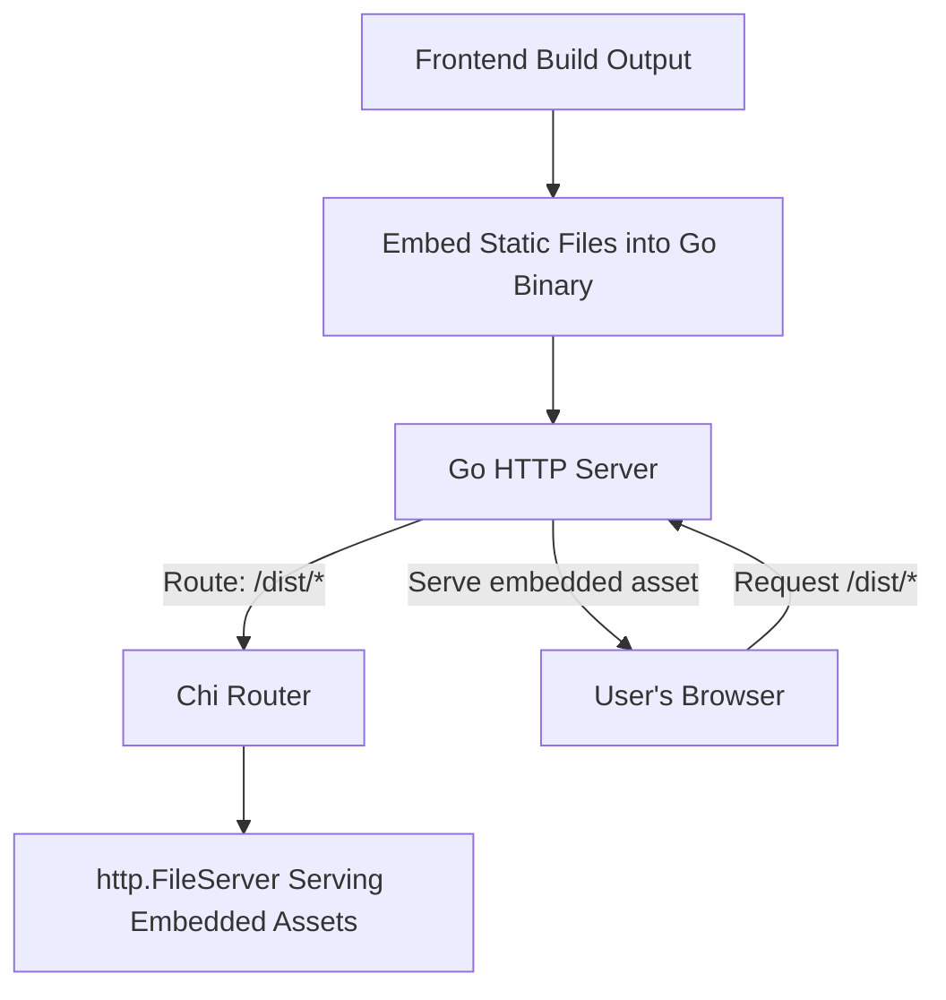

# Table of Contents

- [Overview](#overview)
- [Embedding Static Assets](#embedding-static-assets)
- [Serving Embedded Assets with Chi Router](#serving-embedded-assets-with-chi-router)
- [Integration Details](#integration-details)
- [Example Code](#example-code)
- [Architecture Diagram](#architecture-diagram)
- [Related Source Files](#related-source-files)

---

## Overview

This document explains how static assets such as CSS, JavaScript, and images are embedded directly into the binary of the Go server application and how these embedded assets are served over HTTP. Embedding static assets enhances deployment simplicity by avoiding external file dependencies during runtime and ensures client resources are always bundled with the server.

Embedding and serving static assets enables:

- Packaging frontend build assets within the Go binary.
- Serving these assets through an HTTP router (using `chi`).
- Eliminating the need for a separate static file server or filesystem.

## Embedding Static Assets

Go 1.16 introduced the `embed` package, allowing static files to be embedded in the binary at compile time. In this project, the entire `/internal/assets/dist` directory is embedded to include all frontend distribution files.

This is done by declaring a variable of type `embed.FS` and annotating it with `//go:embed` directive:

```go
package assets

import "embed"

//go:embed dist/*
var Assets embed.FS
```

This embedded filesystem (`Assets`) contains all files within `dist/`, making them accessible via Go code without external dependencies.

## Serving Embedded Assets with Chi Router

To serve the embedded files over HTTP, the chi router mounts a route at `/dist/*`:

- Requests to `/dist/*` URL paths are routed to serve matching embedded files.
- The handler uses `http.FS` to convert the embedded FS into a standard filesystem interface.
- `http.FileServer` serves the files from this virtual filesystem.

Mounting happens in a dedicated function:

```go
func Mount(r chi.Router) {
  // Serve static assets under /dist/
  r.Route("/dist", func(r chi.Router) {
    r.Handle("*", http.FileServer(http.FS(Assets)))
  })
}
```

This ensures any request for `/dist/*` will serve the embedded static files, such as CSS or JS, from the binary.

## Integration Details

### How This Fits in the Application

- Frontend build tools produce static assets placed in `internal/assets/dist`.
- At build time, these assets are embedded into the binary using Go's `embed`.
- The server sets up HTTP routing (using chi) to serve these embedded assets when clients request `/dist/*`.
- This method removes the need to deploy separate static files or maintain a static server alongside the API server.

### Dependencies

- **`embed` package:** For embedding files.
- **`net/http` package:** To serve HTTP requests.
- **`github.com/go-chi/chi/v5`:** HTTP router used to mount asset routes.

### System Touchpoints

- The assets are served as part of the web server entrypoint, alongside other application routes such as `/` (home) and `/todos`.
- Frontend requests for static resources use URLs like `/dist/style.css` which the server responds to with embedded file content.

## Example Code

```go
package assets

import (
  "net/http"
  "embed"

  "github.com/go-chi/chi/v5"
)

//go:embed dist/*
var Assets embed.FS

// Mount mounts the HTTP handler to serve embedded static assets
func Mount(r chi.Router) {
  r.Route("/dist", func(r chi.Router) {
    // Serve embedded files from the Assets FS
    r.Handle("*", http.FileServer(http.FS(Assets)))
  })
}

// Usage example in main.go

/*
router := chi.NewRouter()
assets.Mount(router)
http.ListenAndServe(":3000", router)
*/
```

> **Note:** The `*` wildcard ensures handling of any file path under `/dist`.

## Architecture Diagram



## Related Source Files

- [internal/assets/embed.go](internal/assets/embed.go) — Embedding assets and mount logic
- [cmd/server/main.go](cmd/server/main.go) — Server entrypoint where assets are mounted
- Frontend build directory: `internal/assets/dist` (not source code, but embedded files)

---

Embedding static assets streamlines deployment by packaging web resources inside the binary and serving them seamlessly alongside API endpoints using chi router middleware.