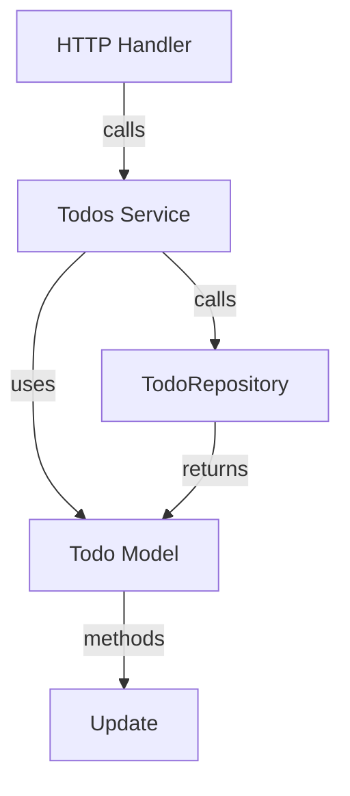

# Todo Model

The **Todo Model** is a core domain component representing individual task items within the Todo application. It encapsulates the data structure and behaviors related to a task, such as its unique identifier, description, completion status, and creation timestamp.

This model serves as the foundational building block for managing todos, enabling other layers like the service and handler layers to perform operations such as creation, update, retrieval, and deletion while maintaining domain integrity.

---

## Table of Contents

- [Overview](#overview)
- [Todo Struct](#todo-struct)
- [Creating a New Todo](#creating-a-new-todo)
- [Updating a Todo](#updating-a-todo)
- [Integration Details](#integration-details)
- [Mermaid Diagram](#mermaid-diagram)
- [References](#references)

---

## Overview

The Todo Model captures the state and data associated with a single todo item. Each Todo has:

- A **UUID** as a unique identifier.
- A **Description** string for the task details.
- A **Completed** boolean flag indicating whether the task is done.
- A **CreatedAt** timestamp recording when the todo was created.

These fields allow the application to handle todos consistently across the domain, service, and presentation layers.

## Todo Struct

The primary data structure is the `Todo` struct defined as follows:

```go
package domain

import (
	"time"
	"github.com/google/uuid"
)

// Todo represents a task item
// with an ID, description, completion status, and creation time.
type Todo struct {
	ID          uuid.UUID
	Description string
	Completed   bool
	CreatedAt   time.Time
}
```

This struct is immutable except through its methods, supporting encapsulation of todo state.

## Creating a New Todo

The model provides a constructor function to create new todo items:

```go
// NewTodo creates a new Todo with a unique ID
// and the provided description.
func NewTodo(description string) *Todo {
	return &Todo{
		ID:          uuid.New(),
		Description: description,
		Completed:   false,
		CreatedAt:   time.Now(),
	}
}
```

Use this function when adding new todos to ensure proper initialization with a unique ID and timestamp.

## Updating a Todo

The Todo model exposes an `Update` method to modify the completed status and description atomically:

```go
// Update modifies the Completed and Description fields
// returns a pointer to the updated Todo.
func (t *Todo) Update(completed bool, description string) *Todo {
	t.Completed = completed
	t.Description = description
	return t
}
```

This method simplifies updating a todo and guarantees state consistency.

---

## Integration Details

### Role in Application Architecture

- **Domain Layer:** The Todo model lives in the domain layer (`internal/domain/todo.go`), encapsulating business data and rules.
- **Persistence & Repository:** Interacts with the `TodoRepository` interface, which manages storage and retrieval.
- **Service Layer:** The Todos Service (`internal/features/todos/service.go`) uses this model to apply business logic and state changes.
- **Handler Layer:** HTTP handlers consume this model to read, display, and manipulate task data.

### Dependencies

- [`github.com/google/uuid`](https://pkg.go.dev/github.com/google/uuid) for generating unique identifiers.
- Standard Go `time` package for timestamps.

### Interaction Flow



- Handlers receive requests and invoke service methods.
- Services manipulate Todo model instances and delegate persistence.
- Repositories implement storage of todos.

This pattern enforces separation of concerns and maintains a clean architecture.

---

## References

- View source code:
  - [Todo Struct and Methods](internal/domain/todo.go)
  - [Todos Collection Model](internal/domain/todos.go)
  - [Todos Service Layer](internal/features/todos/service.go)
  - [TodoRepository Interface](internal/domain/todo_repository.go)

---

For testing and mocking, see:
- [MockTodoRepository](internal/domain/mock_todo_repository.go)
- [Domain Layer Testing](internal/domain/todo_test.go)

---

This completes the overview of the core Todo model within the system, illustrating its design, usage, and architectural role.