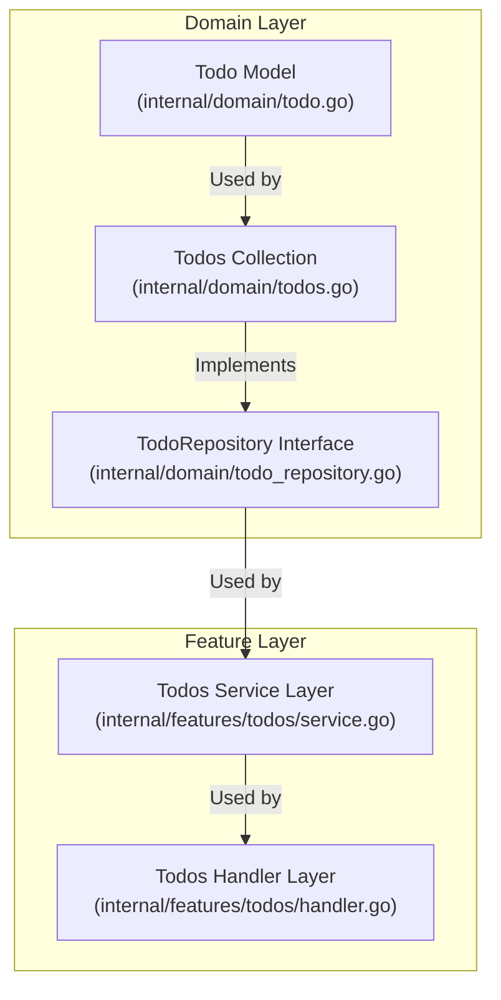

# Table of Contents

- [Overview](#overview)
- [The Todo Struct](#the-todo-struct)
- [Creating and Updating Todos](#creating-and-updating-todos)
- [Todos Collection](#todos-collection)
- [Key Methods of Todos](#key-methods-of-todos)
- [Integration and Architecture](#integration-and-architecture)
- [Example Usage](#example-usage)

---

## Overview

The **Todo model** is the core domain entity representing a task item in the application. It encapsulates the essential data and behaviors associated with a todo item, such as its unique identifier, description, completion status, and creation timestamp.

Alongside the individual Todo struct, the `Todos` type manages a collection of Todo objects and provides methods for adding, removing, updating, searching, and reordering these items. This modeling approach enables clean domain logic encapsulation and serves as the foundational building block for higher layers like services and handlers.

The Todo model is implemented in the domain layer at [`internal/domain/todo.go`](/internal/domain/todo.go) and [`internal/domain/todos.go`](/internal/domain/todos.go).

## The Todo Struct

The `Todo` struct represents a single task with the following fields:

- `ID` (uuid.UUID): A unique identifier for each Todo.
- `Description` (string): The textual content or description of the task.
- `Completed` (bool): A flag indicating if the task is done.
- `CreatedAt` (time.Time): Timestamp marking when the todo was created.

```go
import (
  "time"
  "github.com/google/uuid"
)

// Todo represents a task item.
type Todo struct {
  ID          uuid.UUID
  Description string
  Completed   bool
  CreatedAt   time.Time
}

// NewTodo creates a new Todo with a unique ID and current timestamp.
func NewTodo(description string) *Todo {
  return &Todo{
    ID:          uuid.New(),
    Description: description,
    Completed:   false,
    CreatedAt:   time.Now(),
  }
}

// Update modifies the todo's completed status and description.
func (t *Todo) Update(completed bool, description string) {
  t.Completed = completed
  t.Description = description
}
```

## Creating and Updating Todos

- **Creating a Todo:** Use `NewTodo` to instantiate a new todo with a fresh UUID and creation time.
- **Updating a Todo:** The `Update` method modifies the `Completed` status and `Description` in one call.

This encapsulation promotes immutability of the non-mutable fields like ID and CreatedAt, while allowing state changes on mutable fields.

## Todos Collection

The `Todos` type manages a list of pointers to Todo structs. This collection is responsible for all operations over sets of todos.

```go
// Todos represents a list of todo pointers.
type Todos []*Todo

// NewTodos creates an empty Todos collection.
func NewTodos() *Todos {
  t := make(Todos, 0)
  return &t
}
```

## Key Methods of Todos

`Todos` exposes several methods supporting typical operations:

| Method                     | Description                                              |
|----------------------------|----------------------------------------------------------|
| `Add(description string)`   | Adds a new todo with the given description.              |
| `Remove(id uuid.UUID)`      | Removes the todo matching the given ID.                   |
| `Update(id uuid.UUID, completed bool, description string)` | Updates a todo's completed state and description.  |
| `Search(search string)`     | Finds todos containing the search text (case-insensitive).|
| `All()`                    | Returns all todos in the current order.                   |
| `Get(id uuid.UUID)`         | Retrieves a todo by its ID.                               |
| `Reorder(ids []uuid.UUID)`  | Reorders the todos to match the given list of IDs.       |

### Example - Add method snippet:

```go
func (t *Todos) Add(description string) *Todo {
  newTodo := NewTodo(description)   // Create new Todo instance
  *t = append(*t, newTodo)          // Append to the underlying slice
  return newTodo
}
```

### Searching todos example:

```go
func (t *Todos) Search(search string) []*Todo {
  if search == "" {
    return t.All() // Return all if no search term
  }
  search = strings.ToLower(search)
  var filtered []*Todo
  for _, todo := range *t {
    if strings.Contains(strings.ToLower(todo.Description), search) {
      filtered = append(filtered, todo)
    }
  }
  return filtered
}
```

## Integration and Architecture

The Todo model lives in the domain layer and forms the foundational data structure for todo management. It is independent of transport or persistence logic but interfaces closely with:

- **TodoRepository Interface (`internal/domain/todo_repository.go`):** Abstracts persistence of Todos.
- **Services in features (`internal/features/todos/service.go`):** Implement business logic on top of `Todos` or the repository.
- **Handlers in features (`internal/features/todos/handler.go`):** Expose APIs using the service layer with Todo data.

The diagram below illustrates the main relationships:



## Example Usage

Here is a minimal example demonstrating creation and manipulation of todos:

```go
package main

import (
	"fmt"
	"github.com/google/uuid"
	"internal/domain"
)

func main() {
  todos := domain.NewTodos()                      // Initialize empty Todos collection
  todo := todos.Add("Write documentation")     // Add a new todo

  fmt.Println(todo.ID, todo.Description, todo.Completed)

  // Update the todo
  todos.Update(todo.ID, true, "Write complete docs")

  // Search todos
  results := todos.Search("docs")
  for _, t := range results {
    fmt.Println(t.Description, "Completed?", t.Completed)
  }
}
```

---

For the implementation details, you can explore the source code files:

- [`internal/domain/todo.go`](internal/domain/todo.go)
- [`internal/domain/todos.go`](internal/domain/todos.go)
- [`internal/domain/todo_repository.go`](internal/domain/todo_repository.go)

This model forms the backbone of todo management and is leveraged throughout application layers.
