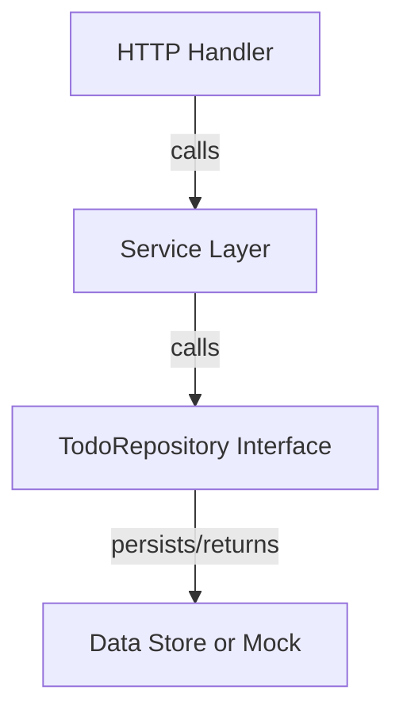
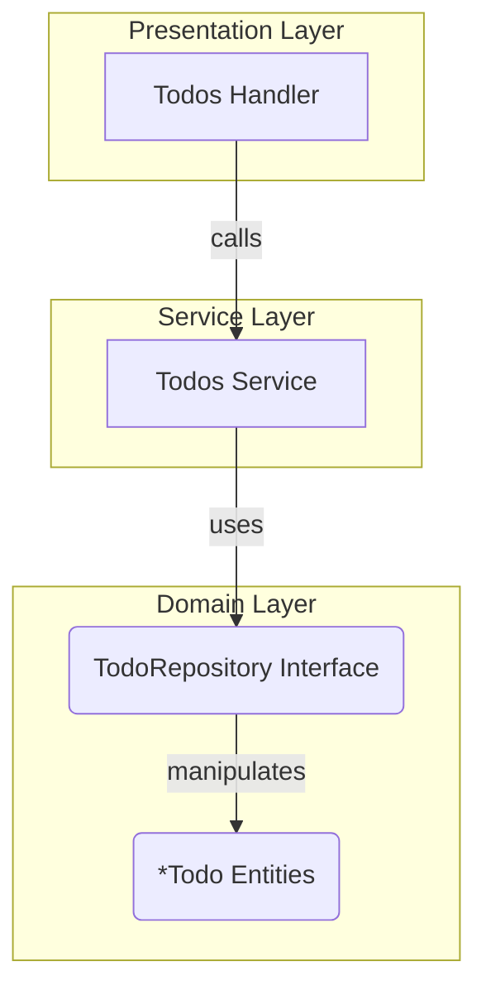

# TodoRepository Interface

The `TodoRepository` interface defines the contract for the data storage layer related to todo items within the domain. It abstracts the details of how todos are persisted, updated, retrieved, and manipulated, allowing the service and handler layers to interact with todo data without coupling to a specific storage implementation.

---

## Table of Contents

- [Overview](#overview)
- [Interface Definition](#interface-definition)
- [Methods](#methods)
- [Example Implementation](#example-implementation)
- [Integration Details](#integration-details)
- [Mermaid Diagram](#mermaid-diagram)
- [Source Code Reference](#source-code-reference)

---

## Overview

The `TodoRepository` interface serves as the domain-layer abstraction for todo persistence. It governs how todos can be:

- Added (created)
- Removed (deleted)
- Updated (modified)
- Searched (filtered by query)
- Retrieved all or individually
- Reordered (rearranged according to a given sequence)

This separation provides flexibility, allowing different storage backends to be used (e.g., in-memory, database, mocks for testing) while keeping business logic clean and focused.

---

## Interface Definition

```go
// TodoRepository defines methods to manage Todo entities
// within the domain layer.
type TodoRepository interface {
    Add(description string) *Todo
    Remove(id uuid.UUID)
    Update(id uuid.UUID, completed bool, description string) *Todo
    Search(search string) []*Todo
    All() []*Todo
    Get(id uuid.UUID) *Todo
    Reorder(ids []uuid.UUID) []*Todo
}
```

Each method is designed to operate on todo entities, identified uniquely by a UUID, and returns relevant results for use by the service layer.

---

## Methods

| Method                         | Description                                               | Input                             | Output                  |
| ------------------------------|-----------------------------------------------------------|----------------------------------|-------------------------|
| `Add(description string)`      | Adds a new todo with the given description                | Description string                | Newly created *Todo      |
| `Remove(id uuid.UUID)`         | Removes the todo identified by the given ID               | UUID                             | None                    |
| `Update(id uuid.UUID, completed bool, description string)` | Updates a todo's completion status and description | UUID, Completion flag, Description | Updated *Todo           |
| `Search(search string)`        | Searches todos matching the search query                  | Search string                    | Slice of matching *Todo |
| `All()`                       | Retrieves all todos                                        | None                             | Slice of all *Todo      |
| `Get(id uuid.UUID)`            | Retrieves a single todo by ID                              | UUID                             | Queried *Todo           |
| `Reorder(ids []uuid.UUID)`      | Reorders todos according to given IDs                      | Slice of UUIDs                   | Slice of reordered *Todo|

---

## Example Implementation

Here is a minimal example illustrating how one might implement the `TodoRepository` interface backed by an in-memory slice:

```go
import (
    "github.com/google/uuid"
    "sync"
)

type InMemoryTodoRepository struct {
    todos []*Todo
    mu    sync.Mutex
}

func NewInMemoryTodoRepository() *InMemoryTodoRepository {
    return &InMemoryTodoRepository{}
}

func (r *InMemoryTodoRepository) Add(description string) *Todo {
    r.mu.Lock()
    defer r.mu.Unlock()

    todo := NewTodo(description)
    r.todos = append(r.todos, todo)
    return todo
}

// Other methods (Remove, Update, etc.) follow similar pattern
```

This example locks during updates to ensure thread safety in concurrent environments.

---

## Integration Details

The `TodoRepository` interface plays a pivotal role in the architecture by:

- **Decoupling domain data logic from storage**: Services and handlers depend on this interface, enabling easier swapping of storage implementations.
- **Facilitating Testing**: Mock implementations can be injected during tests to simulate repository behavior without a real database.
- **Representing the Domain Model Boundary**: Acts as the data access boundary of the domain layer, enforcing separation between domain logic and persistence.

### Typical Interaction Pattern



Here, handlers use services to process requests. Services call the repository interface to fetch or modify todo data, which interacts with the actual data store.

### Key Dependencies

- The repository requires unique todo identification, typically using `uuid.UUID`.
- Todo entities come from the domain model (`*Todo` from the domain package).

---

## Mermaid Diagram



This diagram illustrates the layers and their interactions involving `TodoRepository`.

---

## Source Code Reference

- You can find the full interface and declarations in the domain layer source: [`internal/domain/todo_repository.go`](/internal/domain/todo_repository.go)

This centralized implementation is the backbone of data persistence in the todo application.

---

Explore additional domain abstractions and implementations such as the [`MockTodoRepository`](/internal/domain/mock_todo_repository.go) for testing and the [`Todos`](/internal/domain/todos.go) collection that works with the repository interface.

---

<Info>Understanding the `TodoRepository` interface helps in customizing storage solutions, extending the system, or writing integration tests by leveraging domain-driven design principles.</Info>
