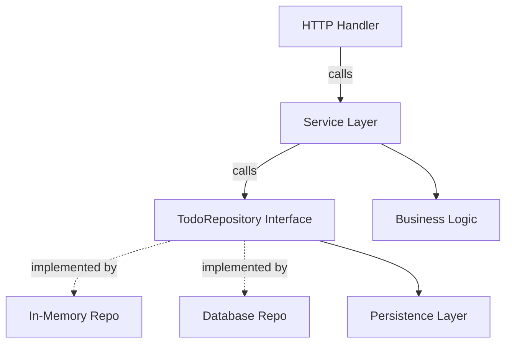

# TodoRepository Interface

The `TodoRepository` interface defines the contract for managing todo items within the domain layer of the application. It abstracts the details of storing, retrieving, updating, and deleting todo entities, allowing service layers and handlers to interact with todos without concerning themselves with storage implementation.

This interface plays a central role in the domain-driven design of the application and serves as the foundation for persistence operations on todo data.

---

## Table of Contents

- [Overview](#overview)
- [Interface Methods](#interface-methods)
- [Code Example](#code-example)
- [Integration and Architecture](#integration-and-architecture)
- [Mermaid Diagram](#mermaid-diagram)
- [Related Files](#related-files)

---

## Overview

The `TodoRepository` interface is defined in the domain layer to provide a unified set of methods for todo item management. It encapsulates all operations needed to create, update, delete, search, reorder, and fetch todos.

By abstracting the storage operations, this interface allows different persistence implementations (e.g., in-memory, database, mocks) to be swapped seamlessly without impacting the business logic or HTTP layers.

---

## Interface Methods

| Method | Description |
|--------|-------------|
| `Add(description string) *Todo` | Creates and adds a new todo item with the given description.
| `Remove(id uuid.UUID)` | Deletes the todo with the given unique identifier.
| `Update(id uuid.UUID, completed bool, description string) *Todo` | Updates the completed status and description of the specified todo.
| `Search(search string) []*Todo` | Searches todos matching the provided query string.
| `All() []*Todo` | Retrieves all todo items.
| `Get(id uuid.UUID) *Todo` | Retrieves a specific todo by its unique ID.
| `Reorder(ids []uuid.UUID) []*Todo` | Reorders todos to match the given ID order.

---

## Code Example

```go
package domain

import (
  "github.com/google/uuid"
)

// TodoRepository provides access to manage todo entities.
type TodoRepository interface {
  Add(description string) *Todo
  Remove(id uuid.UUID)
  Update(id uuid.UUID, completed bool, description string) *Todo
  Search(search string) []*Todo
  All() []*Todo
  Get(id uuid.UUID) *Todo
  Reorder(ids []uuid.UUID) []*Todo
}

// Example usage in service layer
func ExampleUsage(repo TodoRepository) {
  // Add a new todo
  newTodo := repo.Add("Write documentation")

  // Update todo
  updatedTodo := repo.Update(newTodo.ID, true, "Write complete docs")

  // Search todos
  results := repo.Search("docs")

  // Reorder todos
  var ids []uuid.UUID
  for _, t := range results {
    ids = append(ids, t.ID)
  }
  repo.Reorder(ids)
}
```

---

## Integration and Architecture

### Role in the System

- **Domain Layer**: The `TodoRepository` interface is a core abstraction in the domain layer.
- **Service Layers**: Features like the Todos and Home service use this interface to implement business logic without direct dependence on persistence details.
- **Handlers**: HTTP handlers depend on services that abstract the repository, indirectly interacting with the repository via service methods.

### Dependencies

- Utilizes `uuid.UUID` for uniquely identifying todo items.
- Operates with domain entities such as `Todo`.

### Interaction Pattern

Services call repository methods to:

- Add new todos when receiving create requests.
- Update or remove todos in response to client actions.
- Fetch the entire todo collection or search-specific todos for display.
- Reorder todos as per client-side sorting.

This separation allows for easy replacement or mocking of the repository.

---

## Mermaid Diagram



---

## Related Files

- [`internal/domain/todo_repository.go`](/internal/domain/todo_repository.go) &mdash; Source file defining the `TodoRepository` interface.
- [`internal/features/todos/service.go`](/internal/features/todos/service.go) &mdash; Uses `TodoRepository` interface to implement business logic.
- [`internal/domain/mock_todo_repository.go`](/internal/domain/mock_todo_repository.go) &mdash; Contains a mock implementation used in unit tests.

---

This interface is crucial for maintaining clean separation of concerns and a flexible architecture within the Todo application.
