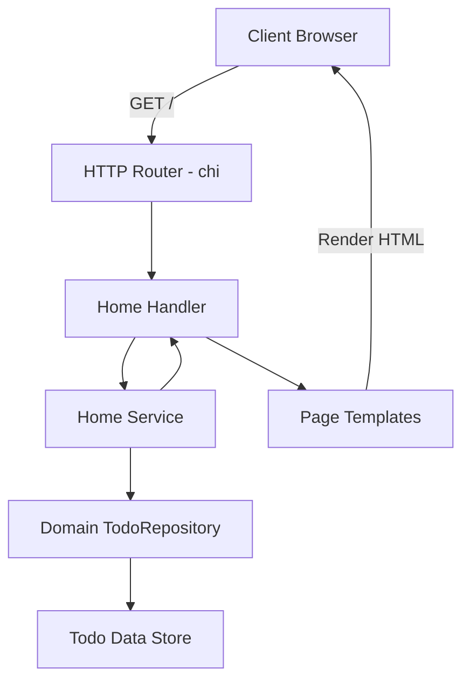

# Table of Contents

- [Introduction](#introduction)
- [Overview of Home Handler](#overview-of-home-handler)
- [Key Methods and Behavior](#key-methods-and-behavior)
- [Code Example](#code-example)
- [Architecture and Integration](#architecture-and-integration)
- [Request Flow Diagram](#request-flow-diagram)
- [Further Reading and References](#further-reading-and-references)

---

## Introduction

The **Home Handler** is a crucial component of the Todo application responsible for processing HTTP requests at the root URL `/`. Its primary function is to retrieve the current list of todos and serve the home page, which serves as the entry point for end users to view their todo list.

This documentation provides a detailed overview of the Home Handler's role, its interface, core behavior, sample usage, and how it integrates with other layers of the application.

---

## Overview of Home Handler

The Home Handler acts as the HTTP controller layer for the Home feature of the application. It:

- Handles incoming GET requests to the root `/` path.
- Calls the Home Service to obtain the current list of todos.
- Constructs and renders the home page UI using the template system.

By isolating the HTTP request handling logic, it simplifies testing and promotes separation of concerns.

---

## Key Methods and Behavior

The Home Handler exposes the following key functionality:

- **Home(w http.ResponseWriter, r *http.Request):**
  - The main HTTP endpoint handler for root `/` GET requests.
  - Calls the service to list todos.
  - Converts the todo data into a page template.
  - Renders the page to the HTTP response.

- **NewHandler(service Service) Handler:**
  - Factory function that creates a new Home Handler instance wired with a Home Service.

- **Mount(r chi.Router, h Handler):**
  - Utility method to register the handler routes to a given router.

### Concepts

- **Handler Interface:** Encapsulates the HTTP handler methods for the Home feature.
- **Service Layer:** Provides business logic to list todos and acts as an abstraction over the domain repository.
- **Rendering Layer:** Uses templating to produce the final HTML page that the user sees.

---

## Code Example

```go
package home

import (
  "context"
  "net/http"

  "github.com/go-chi/chi/v5"
  "yourmodule/internal/templates/pages"
)

// Handler interface defines HTTP handler methods for home feature
type Handler interface {
  Home(w http.ResponseWriter, r *http.Request)
}

// handler is the concrete implementation composing a service
type handler struct {
  service Service
}

// NewHandler creates a new home.Handler
func NewHandler(svc Service) Handler {
  return &handler{service: svc}
}

// Mount sets up the routes for the home handler
func Mount(r chi.Router, h Handler) {
  r.Get("/", h.Home)
}

// Home serves the root page with a list of todos
func (h *handler) Home(w http.ResponseWriter, r *http.Request) {
  ctx := r.Context()
  todos, err := h.service.List(ctx) // Retrieve todos from service
  if err != nil {
    http.Error(w, "Failed to load todos", http.StatusInternalServerError)
    return
  }

  page := pages.HomePage(todos) // Create a page template with todos
  if err := page.Render(ctx, w); err != nil { // Render page to response
    http.Error(w, "Failed to render page", http.StatusInternalServerError)
  }
}
```

This example demonstrates the core flow of the Home Handler:

1. Receive an HTTP request on `/`.
2. Call `service.List` to fetch todos.
3. Build a templated page.
4. Render HTML to the client.

---

## Architecture and Integration

The Home Handler operates within the following architectural context:

- **Incoming HTTP Requests:** Routed by the main application router and directed to the Home Handler.
- **Home Service:** The handler calls the service layer to perform business logic operations. The service in turn uses the domain `TodoRepository` to fetch data.
- **Templates:** The handler constructs page objects that encapsulate todo data and delegate rendering using the templating engine.

### Dependencies

- `internal/features/home/service.go`: Provides the `Service` interface used by the handler.
- `internal/domain/todo_repository.go`: Abstract domain repository underlying data operations.
- `internal/templates/pages/Home.go`: Defines the UI template for the home page rendering.
- `github.com/go-chi/chi/v5`: Used for routing HTTP requests.

### System Touchpoints

- The Home Handler is mounted on the main chi router inside the server entrypoint.
- It serves as the user interface entry for viewing the todo list.
- It acts as a thin controller, delegating business logic and UI rendering to other layers.

---

## Request Flow Diagram



This diagram shows the vertical layers involved:

- HTTP Router directs root requests to the Home Handler.
- Handler calls service layer for business logic.
- Service fetches domain data.
- Handler uses templates to render the page.
- Response is sent back to the client.

---

## Further Reading and References

- [Home Service](/internal/features/home/service.go) - details business logic to list todos.
- [Domain TodoRepository](/internal/domain/todo_repository.go) - interface for todo data operations.
- [Home Handler Source](/internal/features/home/handler.go) - handler implementation code.
- [Page Templates](/internal/templates/pages) - UI rendering templates for home page.
- [Routing and Server Setup](/Documentation/Architecture/Routing%20and%20Server%20Setup) - app startup and routing.

---

This completes the documentation for the Home Handler feature covering its purpose, core functionality, usage example, integration details, and flow within the overall system.