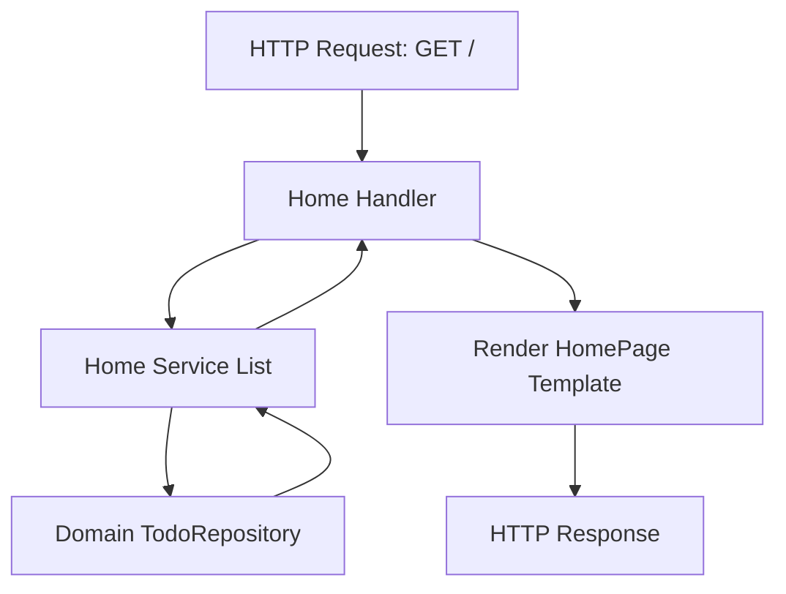

# Table of Contents

- [Overview](#overview)
- [Handler Structure](#handler-structure)
- [Key Endpoints](#key-endpoints)
- [Code Example](#code-example)
- [Integration & Dependencies](#integration--dependencies)
- [Flow Diagram](#flow-diagram)

---

## Overview

The Home Handler is responsible for processing HTTP requests to the root path (`/`) of the application, providing a user interface entry point to display a list of todo items. It acts as the web layer connecting the backend service logic to the HTTP layer, fetching todos via the Home Service and rendering the home page template.

This handler primarily handles **GET /** requests that retrieve all todo items and renders them using server-side templates to create the home page.

---

## Handler Structure

The Home Handler exposes an interface and concrete implementation encapsulating all HTTP request handling logic for the home feature.

- It depends on a `Service` interface that provides listing functionality to retrieve todos.
- It exposes a method to mount itself to a router under the root path.
- The core handler function uses the service to fetch todos, then renders the page using internal templates.

### Key Components:

| Component       | Description                                                |
|-----------------|------------------------------------------------------------|
| `Handler`       | Interface for handling home page routes                    |
| `NewHandler(svc)` | Instantiates a handler with a Home Service                 |
| `Mount(r, h)`   | Mounts the handler to a router under path `/`              |
| `handler.Home`  | Handles GET `/` requests, lists todos, and renders page    |

---

## Key Endpoints

### GET `/`

- Fetches the todo list via the service layer.
- Renders the home page HTML with todo data.
- Returns proper HTTP status and error handling if list retrieval fails.

This endpoint serves as the main landing page and displays the collection of todos to the user.

---

## Code Example

```go
package home

import (
  "context"
  "net/http"

  "github.com/go-chi/chi/v5"
  "internal/domain"
  "internal/templates/pages"
)

// Handler interface for the home feature
type Handler interface {
  Mount(r chi.Router)
}

// concrete handler
type handler struct {
  service Service
}

// NewHandler returns a new home handler
func NewHandler(svc Service) Handler {
  return &handler{service: svc}
}

// Mount mounts HTTP handlers on router
func Mount(r chi.Router, h Handler) {
  h.Mount(r)
}

func (h *handler) Mount(r chi.Router) {
  r.Get("/", h.Home)
}

// Home handles GET /
func (h *handler) Home(w http.ResponseWriter, r *http.Request) {
  ctx := r.Context()
  todos, err := h.service.List(ctx)
  if err != nil {
    http.Error(w, "Failed to load todos", http.StatusInternalServerError)
    return
  }

  page := pages.HomePage(todos)
  if err := page.Render(ctx, w); err != nil {
    http.Error(w, "Failed to render page", http.StatusInternalServerError)
  }
}
```

---

## Integration & Dependencies

The Home Handler fits into the overall system architecture as described below:

- **Dependency on Home Service**: The handler depends on the Home Service interface that provides a method to list all todos. This service abstracts away all business logic and data retrieval.

- **Router Integration**: The handler mounts its routes on a `chi` router under path `/`, allowing it to serve home page requests.

- **Templates**: Uses internal template packages (`internal/templates/pages`) to render the home HTML view.

- **Domain Model**: The todos returned by the service are domain entities (`[]*domain.Todo`), ensuring separation of concerns.

- **Other Components**:
  - The Home Service implementation typically wraps a domain repository to access todos.
  - Higher level routing is configured to combine this handler with others (e.g., `/todos` routes, static assets).

#### Integration Pattern



- The handler receives the request and calls the service.
- The service fetches todos from the domain repository.
- The handler renders the HTML page using the fetched todos.
- The HTTP response with rendered content is returned.

---

## Source Links

- See the handler implementation code: [internal/features/home/handler.go](/internal/features/home/handler.go)
- Home Service interface and implementation: [internal/features/home/service.go](/internal/features/home/service.go)
- Template rendering for home page: [internal/templates/pages/home.go](/internal/templates/pages/home.go)

---

This concise yet extensible design allows the Home Handler to serve as the entrypoint of the web UI while cleanly separating concerns across routing, service logic, domain model, and presentation.
