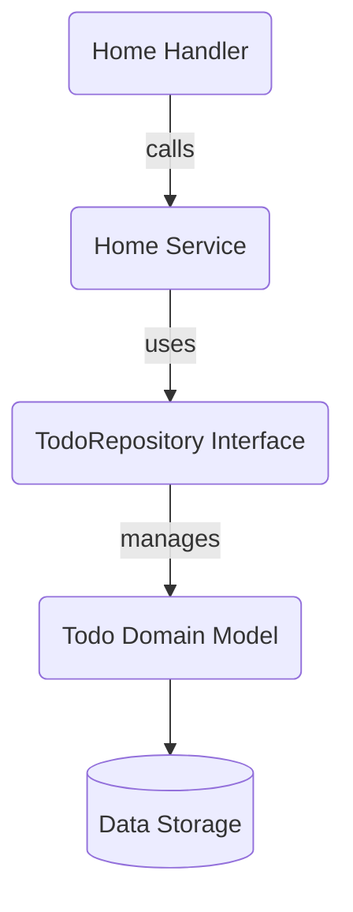

# Table of Contents

- [Introduction](#introduction)
- [Service Overview](#service-overview)
- [Key Methods](#key-methods)
- [Example Usage](#example-usage)
- [Integration Details](#integration-details)
- [Architecture Diagram](#architecture-diagram)
- [See Also](#see-also)

---

## Introduction

The Home Service is a core part of the application's feature layer responsible for managing the logic behind the home page of the Todo web application. It abstracts operations related to listing todo items by interacting with the domain layer's `TodoRepository` interface. This service serves as the business logic layer between the HTTP handlers and the domain entities.

The Home Service primarily focuses on retrieving and providing a read-only list of todos to the home page handler without modifying the underlying data.

## Service Overview

The Home Service is defined as an interface and implemented by a private struct that holds a reference to a `TodoRepository`. This repository is responsible for CRUD operations on todo items at the domain level.

### Key Responsibilities

- Fetching all todos to be displayed on the home page
- Delegating data access and query operations to the domain repository

This clear separation keeps the home feature lean, focusing on data retrieval for the home view.

## Key Methods

### List(ctx context.Context) ([]*domain.Todo, error)

- Retrieves a complete list of todos.
- Returns a slice of pointers to `domain.Todo` and an error in case of failure.

## Example Usage

```go
package home

import (
  "context"
  "internal/domain"
)

// Service defines the interface for home service
type Service interface {
  List(ctx context.Context) ([]*domain.Todo, error)
}

// service implements the Service interface
// it encapsulates a TodoRepository for data access

type service struct {
  todos domain.TodoRepository
}

// NewService creates a new service with the given TodoRepository
func NewService(todos domain.TodoRepository) Service {
  return &service{todos: todos}
}

// List fetches all todos from the repository
func (s *service) List(ctx context.Context) ([]*domain.Todo, error) {
  return s.todos.All()
}
```

## Integration Details

The Home Service acts as a mediator between the HTTP handler layer (`internal/features/home/handler.go`) and the domain layer's `TodoRepository` (`internal/domain/todo_repository.go`). It depends on:

- `domain.TodoRepository` interface, which abstracts data operations on todos.
- The service does not mutate data, keeping responsibility limited to read operations.

### Interaction Pattern

1. **Handler Layer:** The HTTP handler calls `List` to retrieve todos for rendering the homepage.
2. **Service Layer:** Delegates to the domain repository to access the stored todos.
3. **Domain Layer:** Returns the list of todos, possibly from memory or persistent storage.

This layered architecture ensures separation of concerns, testability, and maintainability.

## Architecture Diagram



## See Also

- [Home Handler](internal/features/home/handler.go) — Connects HTTP routes to the Home Service
- [TodoRepository Interface](internal/domain/todo_repository.go) — Domain contract for todo data access
- [Todos Model](internal/domain/todos.go) — Domain model representing collections of todos
- [Todos Feature Overview](internal/features/todos) — For managing todo CRUD and sorting operations
- [Main Server Entrypoint](cmd/server/main.go) — Shows service initialization and injection

---

For full implementation details, visit the [home service source file](internal/features/home/service.go).
