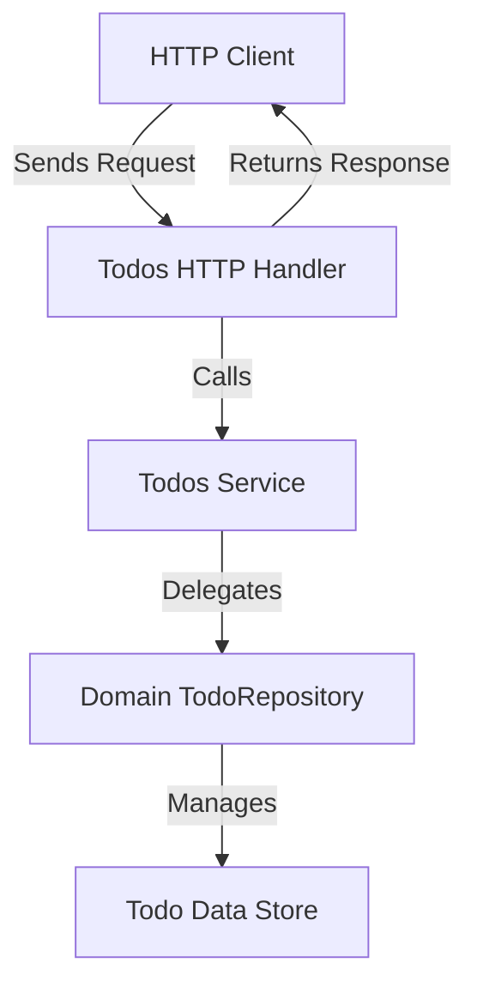

# Todos Service

The **Todos Service** is the core business logic layer responsible for managing todo items. It acts as an intermediary between the lower-level domain repository (which manages raw data storage and retrieval) and the HTTP handlers that expose the functionality via API endpoints.

This service provides a clean interface to add, update, remove, search, get, and reorder todos. It encapsulates the domain logic and data manipulation rules, ensuring the rest of the application code remains decoupled from persistence details.

---

## Table of Contents

- [Overview](#overview)
- [Service Interface](#service-interface)
- [Service Implementation](#service-implementation)
- [Usage Example](#usage-example)
- [Integration](#integration)
- [Mermaid Diagram](#mermaid-diagram)

---

## Overview

The Todos Service abstracts the todo management operations on a collection of todo items, allowing the application to:

- Add new todo items with a description.
- Remove todos by their unique IDs.
- Update todos (including completion status and description).
- Search todos by text query.
- Retrieve a specific todo by ID.
- Reorder the list of todos based on user-supplied ordering.

It relies on the `TodoRepository` interface from the domain layer, which handles data persistence and retrieval. This separation enables easy unit testing and swapping of persistence layers.

---

## Service Interface

```go
// Service defines the contract for todo management business logic.
type Service interface {
    Add(ctx context.Context, description string) (*domain.Todo, error)
    Remove(ctx context.Context, id uuid.UUID) error
    Update(ctx context.Context, id uuid.UUID, completed bool, description string) (*domain.Todo, error)
    Search(ctx context.Context, search string) ([]*domain.Todo, error)
    Get(ctx context.Context, id uuid.UUID) (*domain.Todo, error)
    Sort(ctx context.Context, ids []uuid.UUID) error
}
```

- `Add` creates and stores a new todo with the given description.
- `Remove` deletes the todo identified by the given UUID.
- `Update` modifies the completed state and description of an existing todo.
- `Search` returns all todos that match a search string.
- `Get` retrieves a todo by ID.
- `Sort` allows reordering todos by a slice of todo IDs representing the desired order.

---

## Service Implementation

The concrete implementation `service` contains a reference to a `TodoRepository`, which handles the data layer.

```go
type service struct {
    todos domain.TodoRepository
}

func NewService(todos domain.TodoRepository) Service {
    return &service{todos: todos}
}

func (s *service) Add(ctx context.Context, description string) (*domain.Todo, error) {
    return s.todos.Add(description)
}

func (s *service) Remove(ctx context.Context, id uuid.UUID) error {
    s.todos.Remove(id)
    return nil
}

func (s *service) Update(ctx context.Context, id uuid.UUID, completed bool, description string) (*domain.Todo, error) {
    return s.todos.Update(id, completed, description), nil
}

func (s *service) Search(ctx context.Context, search string) ([]*domain.Todo, error) {
    return s.todos.Search(search), nil
}

func (s *service) Get(ctx context.Context, id uuid.UUID) (*domain.Todo, error) {
    return s.todos.Get(id), nil
}

func (s *service) Sort(ctx context.Context, ids []uuid.UUID) error {
    s.todos.Reorder(ids)
    return nil
}
```

The implementation primarily delegates calls directly to the domain repository but can contain additional business-level validations or transformations as needed.

---

## Usage Example

Below is a minimal usage example illustrating how to create a Todos Service instance and add a todo.

```go
package main

import (
    "context"
    "fmt"
    "github.com/google/uuid"
    "internal/domain"
    "internal/features/todos"
)

func main() {
    // Initialize domain in-memory todo repository
    todoRepo := domain.NewTodos()

    // Create service layer
    service := todos.NewService(todoRepo)

    ctx := context.Background()

    // Add a new todo
    todo, err := service.Add(ctx, "Write documentation")
    if err != nil {
        panic(err)
    }

    fmt.Printf("Added Todo: %s - %s\n", todo.ID, todo.Description)

    // Fetch and display all todos
    todos, _ := service.Search(ctx, "")
    for _, t := range todos {
        fmt.Printf("- [%v] %s\n", t.Completed, t.Description)
    }
}
```

---

## Integration

- **Domain Layer:** The service depends on the `domain.TodoRepository` interface to persist and retrieve todo records.
- **HTTP Handlers:** The service is consumed by HTTP handlers (e.g. `internal/features/todos/handler.go`) that expose endpoints to clients.
- **Routing:** Handlers that use this service are mounted on routes such as `/todos` and `/todos/{todoId}`.
- **Testing:** The service logic can be unit tested with mocks of the `TodoRepository` interface using the mock in `internal/domain/mock_todo_repository.go`.

Typically, the lifecycle is:

User action (HTTP request) -> HTTP Handler (parses data) -> Todos Service (business logic) -> Domain Repository (data persistence)

This layered architecture enforces separation of concerns and testability.

---

## Mermaid Diagram



---

For more details, see the [source code for Todos Service](internal/features/todos/service.go).

---

This documentation provides a foundation to understand, use, and integrate the Todos Service within the broader todo application.