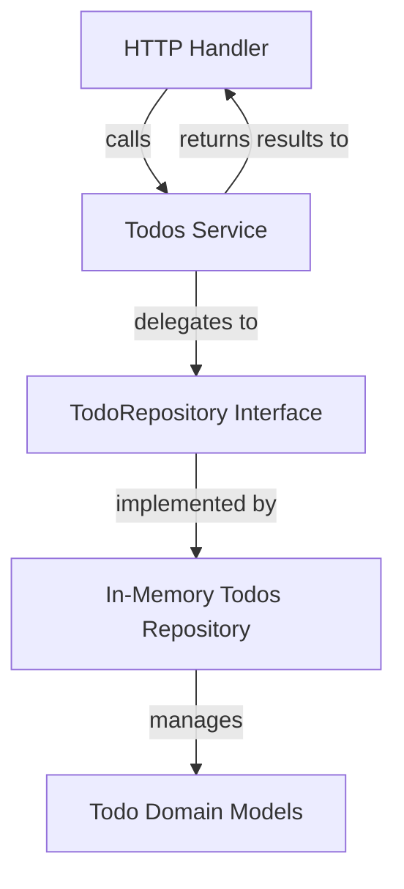

# Todos Service

The Todos Service is the core business logic layer for managing todo items in the application. It acts as an intermediary between the domain layer (which defines the `Todo` model and repository interface) and the HTTP handlers that expose todo features via API endpoints. This service encapsulates operations such as adding, removing, updating, searching, retrieving, and sorting todos.

---

## Table of Contents

- [Overview](#overview)
- [Service Interface](#service-interface)
- [Service Implementation](#service-implementation)
- [Usage Example](#usage-example)
- [Integration with the System](#integration-with-the-system)
- [Mermaid Diagram](#mermaid-diagram)
- [Source Links](#source-links)

---

## Overview

The Todos Service provides a clear and consistent API for managing todo items throughout the application. It utilizes a `TodoRepository` from the domain layer to perform CRUD and search operations on the todo data storage.

This abstraction is crucial to separate concerns, keeping business logic out of HTTP handlers and data persistence, supporting easier testing and maintainability.

---

## Service Interface

The `Service` interface defines the capabilities offered by the todos feature service:

```go
// Service defines todo management operations
type Service interface {
  Add(ctx context.Context, description string) (*domain.Todo, error)
  Remove(ctx context.Context, id uuid.UUID) error
  Update(ctx context.Context, id uuid.UUID, completed bool, description string) (*domain.Todo, error)
  Search(ctx context.Context, search string) ([]*domain.Todo, error)
  Get(ctx context.Context, id uuid.UUID) (*domain.Todo, error)
  Sort(ctx context.Context, ids []uuid.UUID) error
}
```

Each method supports the context for cancellation/timeouts and operates on the domain `Todo` entities or related identifiers.

---

## Service Implementation

The concrete service implementation (`service`) holds a reference to a `TodoRepository` to delegate actual data operations:

```go
// service is the concrete implementation of Service
// It wraps domain.TodoRepository
type service struct {
  todos domain.TodoRepository
}

// NewService creates a new todos Service instance
func NewService(todos domain.TodoRepository) Service {
  return &service{todos: todos}
}

func (s *service) Add(ctx context.Context, description string) (*domain.Todo, error) {
  return s.todos.Add(description)
}

func (s *service) Remove(ctx context.Context, id uuid.UUID) error {
  s.todos.Remove(id)
  return nil // domain repo does not error on remove
}

func (s *service) Update(ctx context.Context, id uuid.UUID, completed bool, description string) (*domain.Todo, error) {
  return s.todos.Update(id, completed, description), nil
}

func (s *service) Search(ctx context.Context, search string) ([]*domain.Todo, error) {
  return s.todos.Search(search), nil
}

func (s *service) Get(ctx context.Context, id uuid.UUID) (*domain.Todo, error) {
  return s.todos.Get(id), nil
}

func (s *service) Sort(ctx context.Context, ids []uuid.UUID) error {
  s.todos.Reorder(ids)
  return nil
}
```

*Note:* The service methods delegate to the underlying `TodoRepository` which is an in-memory or persistent store abstraction.

---

## Usage Example

Here's a minimal example illustrating how to create and use the Todos service:

```go
import (
  "context"
  "fmt"
  "github.com/google/uuid"
  "internal/domain"
  "internal/features/todos"
)

func exampleUsage() {
  ctx := context.Background()

  // Create a domain Todos repository instance (in-memory list)
  todoRepo := domain.NewTodos()

  // Initialize Todos service
  svc := todos.NewService(todoRepo)

  // Add a new todo
  todo, err := svc.Add(ctx, "Write documentation")
  if err != nil {
    panic(err)
  }
  fmt.Println("Added todo:", todo.Description)

  // Search todos
  results, _ := svc.Search(ctx, "Write")
  fmt.Printf("Search results count: %d\n", len(results))

  // Update a todo
  updated, _ := svc.Update(ctx, todo.ID, true, "Write comprehensive docs")
  fmt.Println("Updated todo completed status:", updated.Completed)

  // Sort todos by new order
  err = svc.Sort(ctx, []uuid.UUID{todo.ID})
  if err != nil {
    fmt.Println("Failed to sort:", err)
  }
}
```

---

## Integration with the System

- **Domain Layer:** Relies on the `domain.TodoRepository` interface which defines operations on `Todo` models.
- **Handlers:** The Todos Service is consumed by feature HTTP handlers (e.g., [Todos Handler](/internal/features/todos/handler.go)) which expose RESTful endpoints for client interactions.
- **Repository Implementations:** Currently, an in-memory implementation (`domain.NewTodos()`) is used, but this can be swapped with persistent storage implementations without changing service or handler code.
- **Context Propagation:** The service methods accept `context.Context` for request-scoped lifecycle control.

This separation encourages clean architecture principles and makes unit testing straightforward by mocking the `TodoRepository` during service tests.

---

## Mermaid Diagram



---

## Source Links

- Service implementation: [internal/features/todos/service.go](/internal/features/todos/service.go)
- Domain repository interface: [internal/domain/todo_repository.go](/internal/domain/todo_repository.go)
- Domain model: [internal/domain/todo.go](/internal/domain/todo.go)
- Handler consuming the service: [internal/features/todos/handler.go](/internal/features/todos/handler.go)

---