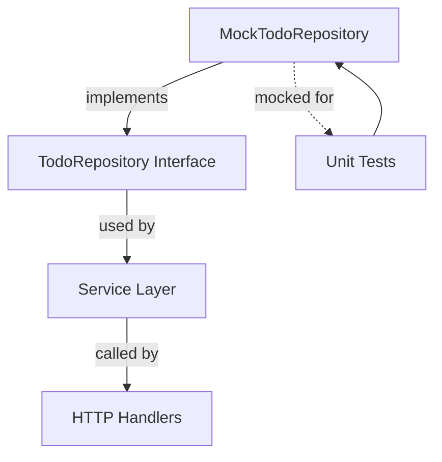

# MockTodoRepository

The **MockTodoRepository** provides a mock implementation of the `TodoRepository` interface used in the domain layer. It is designed for testing purposes, allowing other components of the application to be tested in isolation without relying on a real database or persistence layer.

---

## Table of Contents

- [Overview](#overview)
- [Key Features](#key-features)
- [Usage Example](#usage-example)
- [Integration in the Application](#integration-in-the-application)
- [Code Structure](#code-structure)
- [Mermaid Diagram](#mermaid-diagram)
- [Related Files and Links](#related-files-and-links)

---

## Overview

Within the architecture, the `TodoRepository` defines the core interface for managing Todo items in the domain layer. The `MockTodoRepository` is an autogenerated mock, leveraging the `github.com/stretchr/testify/mock` package, to simulate and verify interactions during testing.

It supports all CRUD operations, plus ordering and searching, mimicking the real repository behavior but without side effects. This enables writing reliable unit and integration tests for services and handlers that depend on todo data management.

---

## Key Features

- Implements all methods from the `TodoRepository` interface: `Add`, `Remove`, `Update`, `Search`, `All`, `Get`, and `Reorder`.
- Provides method call expectation setup and verification for assertions.
- Supports returning mocked results and custom behaviors for each method call.
- Facilitates isolated tests of business logic without relying on actual domain data.

---

## Usage Example

```go
import (
  "testing"
  "github.com/stretchr/testify/mock"
  "github.com/google/uuid"
  "internal/domain"
)

func TestServiceAddTodo(t *testing.T) {
  // Create a new mock repository
  repo := NewMockTodoRepository(t)

  // Setup expected call and return value
  repo.On("Add", "Test todo").Return(&domain.Todo{
    ID: uuid.New(),
    Description: "Test todo",
    Completed: false,
  })

  // Use repo in service or handler tests
  // Example:
  todo := repo.Add("Test todo")

  // Assertions on the returned todo
  if todo.Description != "Test todo" {
    t.Errorf("Expected description 'Test todo', got %s", todo.Description)
  }

  // Verify that expectations were met
  repo.AssertExpectations(t)
}
```

This snippet shows how to create a mock repository, set expectations for the `Add` method call, and verify usage in a test.

---

## Integration in the Application

- **Testing Utility:** The `MockTodoRepository` sits mainly in the testing layer but represents the contract of the domain's `TodoRepository` interface.
- **Isolation of Dependencies:** It decouples service and handler tests from the actual persistence logic by providing controllable and inspectable mocked behavior.
- **Facilitates Mocks:** This mock repository is essential for unit testing features in `internal/features/home` and `internal/features/todos` where Todo management logic is exercised.

Dependencies:
- Depends on the `github.com/stretchr/testify/mock` package for mocking capabilities.
- Implements the `internal/domain.TodoRepository` interface.

---

## Code Structure

The `MockTodoRepository` code includes:

- **Mock Struct:** Embeds `mock.Mock` which tracks methods calls and arguments.
- **Expecter Struct:** Facilitates chaining expectations for method calls.
- **Mocked Methods:** For each interface method (`Add`, `Remove`, `Update`, etc.), it defines:
  - The mock implementation forwarding to `mock.Mock`.
  - Return and run methods to customize behavior during tests.
- **Constructor:** `NewMockTodoRepository(t mockConstructorTestingTNewMockTodoRepository) *MockTodoRepository` for easy instantiation in tests.

---

## Mermaid Diagram


*Diagram illustrating MockTodoRepository's role in testing within the architecture.*

---

## Related Files and Links

- [`TodoRepository` interface definition](/internal/domain/todo_repository.go)
- [Concrete `Todos` implementation](/internal/domain/todos.go)
- [`MockTodoRepository` source code](/internal/domain/mock_todo_repository.go)
- [Domain model `Todo` definition](/internal/domain/todo.go)
- [Example unit tests using `MockTodoRepository`](/internal/domain/todo_test.go)

---

<Note>For detailed usage and auto-generated code, refer to the source file `internal/domain/mock_todo_repository.go` which includes all mock setup and autogenerated mocks based on the `TodoRepository` interface.</Note>
