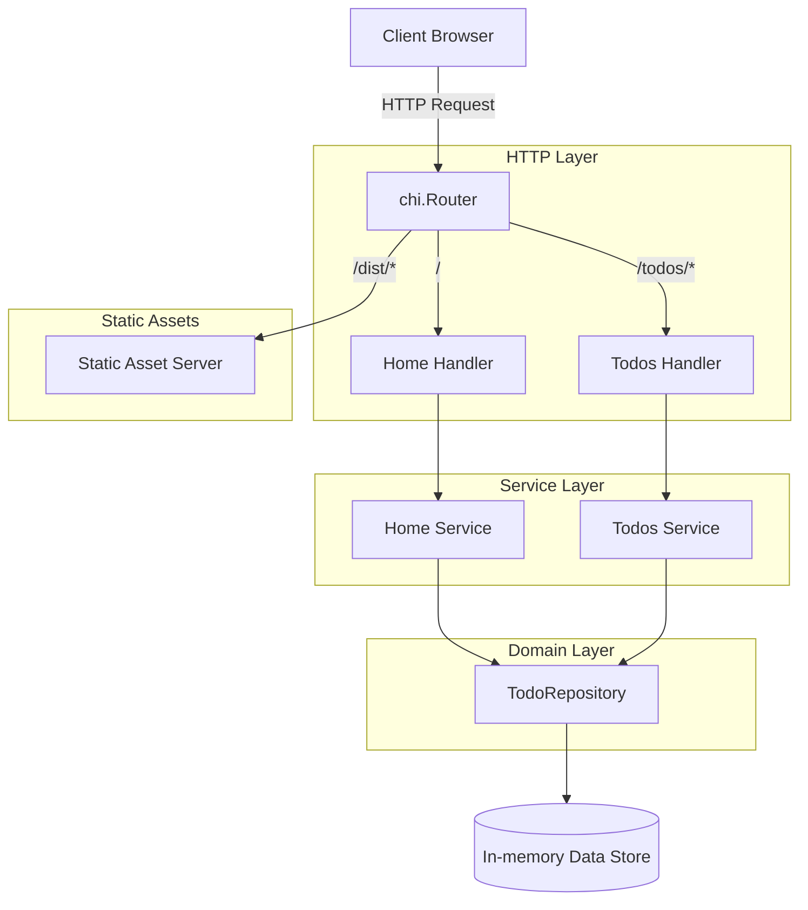

# Table of Contents

- [Introduction](#introduction)
- [Overall Architecture](#overall-architecture)
- [Core Layers and Components](#core-layers-and-components)
  - [Domain Layer](#domain-layer)
  - [Service Layer](#service-layer)
  - [HTTP Handlers and Routing](#http-handlers-and-routing)
  - [Static Assets and Frontend](#static-assets-and-frontend)
- [Request Flow Diagram](#request-flow-diagram)
- [Integration Details](#integration-details)
- [Example: Server Setup](#example-server-setup)

---

## Introduction

This document provides a comprehensive overview of the application architecture. It is intended to explain the structural design, key components, and how they interact to form the complete todo web server application. Understanding this architecture makes it easier to extend, maintain, and troubleshoot the codebase.

The application follows a modular design with distinct layers:
- Domain layer encapsulating core business logic and models.
- Service layer managing business rules and operations.
- HTTP handlers exposing RESTful endpoints and integrating with rendering templates.
- Routing setup and static asset serving for client resources.


## Overall Architecture

The application is organized around a layered architecture promoting separation of concerns:

<AccordionGroup title="Architecture Layers">
<Accordion title="Domain Layer">
Contains the domain models and repository interfaces that define the fundamental todo item types and abstract data operations.
</Accordion>
<Accordion title="Service Layer">
Implements business logic by interacting with the domain repository interfaces to perform todo operations like add, update, remove, search, and reorder.
</Accordion>
<Accordion title="Handlers and Routing">
Defines HTTP handlers for specific features (e.g., home page and todos) and mounts them on router endpoints.
</Accordion>
<Accordion title="Static Assets">
Embeds and serves frontend assets (HTML, CSS, JS) using Go's embed package and the chi router.
</Accordion>
</AccordionGroup>


## Core Layers and Components

### Domain Layer

- **Purpose:** Defines the core `Todo` model with fields for ID, description, completion status, and creation timestamp.
- **Todos Collection:** Provides an in-memory list type with methods to add, update, remove, search, reorder, and retrieve todos.
- **Repository Interface:** Abstracts data storage with methods for CRUD and search operations.

The domain lives primarily in the [`internal/domain`](internal/domain) directory with key files:
- [`todo.go`](internal/domain/todo.go) — defines the `Todo` struct and basic methods.
- [`todos.go`](internal/domain/todos.go) — manages collections of todos.
- [`todo_repository.go`](internal/domain/todo_repository.go) — defines the `TodoRepository` interface.

### Service Layer

- **Purpose:** Implements business operations on todos using the domain repository abstraction.
- **Features:** Separate services implement feature-specific logic (e.g., home listing, todos CRUD).

Key files:
- [`internal/features/home/service.go`](internal/features/home/service.go) — service for the home feature listing todos.
- [`internal/features/todos/service.go`](internal/features/todos/service.go) — service implementing add, update, remove, sort, search, get.

### HTTP Handlers and Routing

- **Purpose:** Handle HTTP requests and responses, interact with services, render templates, and return HTML or JSON.
- **Features:** Provide endpoints for home page (`/`), todo management (`/todos`), and sorting.
- **Routing:** Handlers are mounted on a chi router with feature-specific subroutes.

Relevant files:
- [`internal/features/home/handler.go`](internal/features/home/handler.go) — root endpoint `/` handler.
- [`internal/features/todos/handler.go`](internal/features/todos/handler.go) — CRUD endpoints under `/todos`.
- [`cmd/server/main.go`](cmd/server/main.go) — sets up router, mounts handlers, and starts HTTP server.

### Static Assets and Frontend

- **Embedding:** Uses Go 1.16 `embed.FS` to bundle frontend assets inside the binary.
- **Serving:** Serves static files from `/dist` via HTTP using the chi router.

File:
- [`internal/assets/embed.go`](internal/assets/embed.go)


## Request Flow Diagram



This diagram illustrates how client requests are routed to feature handlers, which delegate business logic to services. The services in turn operate on the domain repository for CRUD and other actions. Static asset requests are routed to the embedded asset server.


## Integration Details

- The `cmd/server/main.go` file is the central setup point. It:
  - Parses server port flags.
  - Instantiates the `chi` router.
  - Initializes the todos domain model in memory.
  - Seeds initial todos.
  - Creates service instances for home and todos features.
  - Creates and mounts HTTP handlers.
  - Mounts static assets handler.
  - Starts the HTTP server.

- **Dependency Injection:** Services depend on the domain `TodoRepository` interface, allowing loose coupling and ease of testing.

- **Feature Isolation:** Home and Todos features have separated services and handlers, encapsulating different parts of functionality.

- **Routing:** All HTTP routing is centralized with chi and modularized with handler mounting functions.

- **Static Asset Integration:** Embedded assets enable a single self-contained binary.


## Example: Server Setup

```go
package main

import (
    "flag"
    "net/http"
    "log"

    "github.com/go-chi/chi/v5"
    "internal/domain"
    "internal/features/home"
    "internal/features/todos"
    "internal/assets"
)

func main() {
    var port string
    flag.StringVar(&port, "port", ":3000", "HTTP service port")
    flag.Parse()

    // Create the router
    router := chi.NewRouter()

    // Initialize todo domain repository (in-memory)
    todoList := domain.NewTodos()

    // Seed todos
    todoList.Add("Learn Go")
    todoList.Add("Build a web server")

    // Setup home feature
    homeService := home.NewService(todoList)
    homeHandler := home.NewHandler(homeService)
    home.Mount(router, homeHandler)

    // Setup todos feature
    todosService := todos.NewService(todoList)
    todosHandler := todos.NewHandler(todosService)
    todos.Mount(router, todosHandler)

    // Mount static assets
    assets.Mount(router)

    // Start HTTP server
    log.Printf("Starting server on %s", port)
    err := http.ListenAndServe(port, router)
    if err != nil {
        log.Fatalf("server failed: %v", err)
    }
}
```

For a full implementation refer to the [main.go](/cmd/server/main.go) source.

---

This overview should serve as a foundation to navigate and understand the todo application's structure and data flow.
