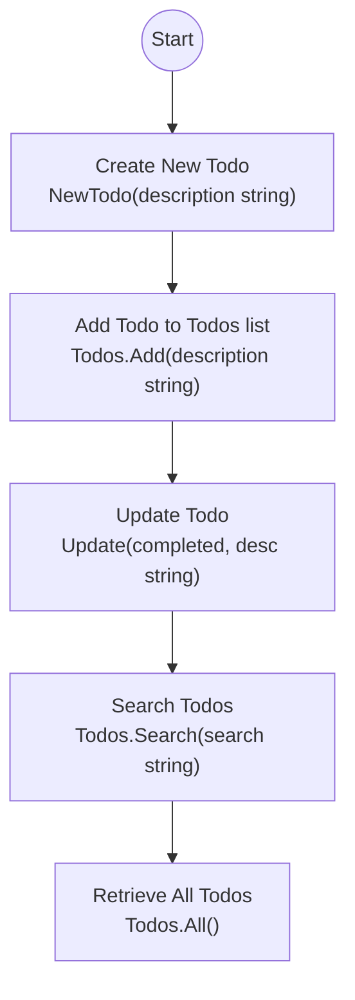

# Table of Contents

- [Overview](#overview)
- [Domain Models](#domain-models)
  - [Todo](#todo)
  - [Todos](#todos)
- [TodoRepository Interface](#todorepository-interface)
- [Integration and Usage](#integration-and-usage)
- [Domain Model Flow](#domain-model-flow)

---

## Overview

The **Domain Model** encapsulates the core business logic and state of the application related to managing todo tasks. This layer focuses on the fundamental **Todo** entity, collections of todos, and the contract (interface) for interacting with todo storage and manipulation.

The domain model abstracts away infrastructural details, providing a clean, behavior-rich API that upper layers (services, handlers) can use to implement application features. It ensures data consistency and enforces business rules around todos.

This documentation explains the main domain types, their responsibilities, interactions, and integration within the system.

---

## Domain Models

### Todo

The `Todo` struct represents a single task with key properties and operations:

- **ID**: A unique identifier (`uuid.UUID`) for the todo.
- **Description**: A string describing the task.
- **Completed**: Boolean flag denoting if the task is done.
- **CreatedAt**: Timestamp when the todo was created.

#### Key Methods

- `NewTodo(description string) *Todo`
  - Creates a new todo instance with a unique ID and current timestamp.

- `Update(completed bool, description string)`
  - Updates the completed status and description of the todo.

```go
package domain

import (
  "github.com/google/uuid"
  "time"
)

// Todo represents a task entity
type Todo struct {
  ID          uuid.UUID
  Description string
  Completed   bool
  CreatedAt   time.Time
}

// NewTodo creates a new Todo with a unique ID and timestamps
func NewTodo(description string) *Todo {
  return &Todo{
    ID:          uuid.New(),
    Description: description,
    Completed:   false,
    CreatedAt:   time.Now(),
  }
}

// Update changes the todo's completed status and description
func (t *Todo) Update(completed bool, description string) {
  t.Completed = completed
  t.Description = description
}
```

---

### Todos

`Todos` represents a collection of `Todo` items. It provides methods for common list operations including:

- Add new todos
- Remove todos by ID
- Update existing todos
- Search todos by text query
- Retrieve all todos
- Reorder todos by a specified ID order

#### Key Methods

- `NewTodos() *Todos`
  - Creates a new empty todos list.

- `(t *Todos) Add(description string) *Todo`
  - Adds a new todo with the given description.

- `(t *Todos) Remove(id uuid.UUID)`
  - Removes the todo matching the given ID.

- `(t *Todos) Update(id uuid.UUID, completed bool, description string) *Todo`
  - Updates a todo by ID.

- `(t *Todos) Search(query string) []*Todo`
  - Returns todos matching the search query.

- `(t *Todos) All() []*Todo`
  - Returns all todos.

- `(t *Todos) Get(id uuid.UUID) *Todo`
  - Retrieves a single todo by ID.

- `(t *Todos) Reorder(ids []uuid.UUID) []*Todo`
  - Reorders todos based on the given ID slice.

```go
package domain

// Todos is a collection of Todo pointers
type Todos struct {
  list []*Todo
}

// NewTodos creates an empty Todos list
func NewTodos() *Todos {
  return &Todos{list: []*Todo{}}
}

// Add appends a new Todo to the list
func (t *Todos) Add(description string) *Todo {
  todo := NewTodo(description)
  t.list = append(t.list, todo)
  return todo
}

// Remove deletes a Todo by ID
func (t *Todos) Remove(id uuid.UUID) {
  index := t.indexOf(id)
  if index < 0 {
    return
  }
  t.list = append(t.list[:index], t.list[index+1:]...)
}

// Update modifies a Todo by ID
func (t *Todos) Update(id uuid.UUID, completed bool, description string) *Todo {
  todo := t.Get(id)
  if todo == nil {
    return nil
  }
  todo.Update(completed, description)
  return todo
}

// Search returns todos containing the query in their description
func (t *Todos) Search(search string) []*Todo {
  result := []*Todo{}
  for _, todo := range t.list {
    if strings.Contains(strings.ToLower(todo.Description), strings.ToLower(search)) {
      result = append(result, todo)
    }
  }
  return result
}

// All returns all todos
func (t *Todos) All() []*Todo {
  return t.list
}

// Get finds a todo by id
func (t *Todos) Get(id uuid.UUID) *Todo {
  for _, todo := range t.list {
    if todo.ID == id {
      return todo
    }
  }
  return nil
}

// Reorder rearranges todos to match the order of ids
func (t *Todos) Reorder(ids []uuid.UUID) []*Todo {
  reordered := []*Todo{}
  for _, id := range ids {
    todo := t.Get(id)
    if todo != nil {
      reordered = append(reordered, todo)
    }
  }
  t.list = reordered
  return reordered
}

// indexOf returns the index of a todo by id
func (t *Todos) indexOf(id uuid.UUID) int {
  for i, todo := range t.list {
    if todo.ID == id {
      return i
    }
  }
  return -1
}
```

---

## TodoRepository Interface

The `TodoRepository` interface defines an abstraction over the persistence mechanism for todos. It ensures that the domain model can interact with any data store in a consistent way.

This interface includes methods for:

- Adding todos
- Removing todos by ID
- Updating todos
- Searching by text
- Retrieving all todos
- Getting a specific todo by ID
- Reordering todos

```go
package domain

import "github.com/google/uuid"

// TodoRepository defines methods to manage todo persistence
type TodoRepository interface {
  Add(description string) *Todo
  Remove(id uuid.UUID)
  Update(id uuid.UUID, completed bool, description string) *Todo
  Search(search string) []*Todo
  All() []*Todo
  Get(id uuid.UUID) *Todo
  Reorder(ids []uuid.UUID) []*Todo
}
```

This separation allows the rest of the application to depend solely on the interface rather than concrete implementations.

---

## Integration and Usage

The domain model acts as the core logic layer for todo management. It is typically used by **services** which implement business logic and by **handlers** that expose HTTP endpoints.

### Integration Highlights:

- The domain's `Todos` type can be used as an **in-memory repository** for simple cases.
- More complex repositories can implement the `TodoRepository` interface using databases or other storage.
- Services consume the repository interface to provide business use cases like listing, updating, and sorting todos.
- HTTP handlers invoke service methods, passing user input down to domain logic.

### Dependency Graph (Simplified)

```mermaid
flowchart TD
  Repository["TodoRepository Interface"]
  Todos["Todos (In-memory)"
   (implements TodoRepository)]
  Service["Todos Service"]
  Handler["Todos Handler"]
  User["User/Client"]

  User -->|HTTP Requests| Handler
  Handler -->|Calls| Service
  Service -->|Uses| Repository
  Todos -->|Implements| Repository
```

### Example Usage in Application Setup (go)

```go
list := domain.NewTodos()
list.Add("Buy milk")
list.Add("Read book")

svc := todos.NewService(list) // service depends on domain.TodoRepository
handler := todos.NewHandler(svc) // handler uses service

// Mount handler routes and start server...
```

For full details on this integration, see the [server main entrypoint](cmd/server/main.go).

---

## Domain Model Flow



This flow shows the lifecycle of a todo from creation, addition to the list, potential updates, searching, and retrieving all todos.

---

## Related Links

- [Todo Model](internal/domain/todo.go)
- [Todos Model](internal/domain/todos.go)
- [TodoRepository Interface](internal/domain/todo_repository.go)
- [Todos Service Layer](internal/features/todos/service.go)
- [Todos HTTP Handler](internal/features/todos/handler.go)

---

<Note>
The domain layer is designed to be independent and free from infrastructural concerns, promoting clean architecture principles and ease of testing.
</Note>
