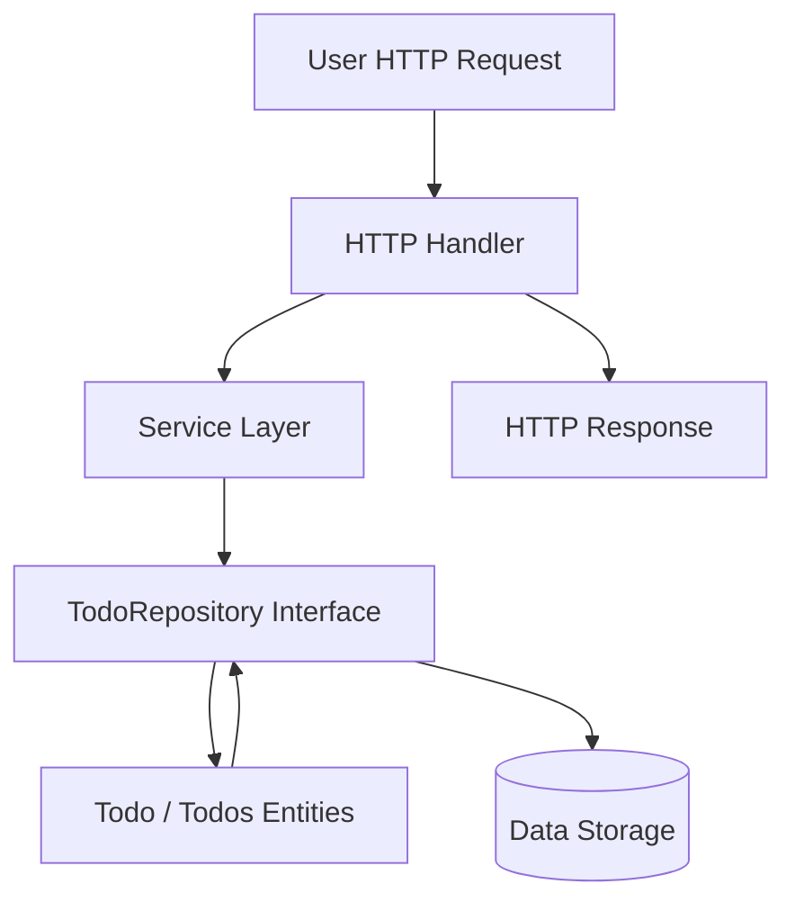
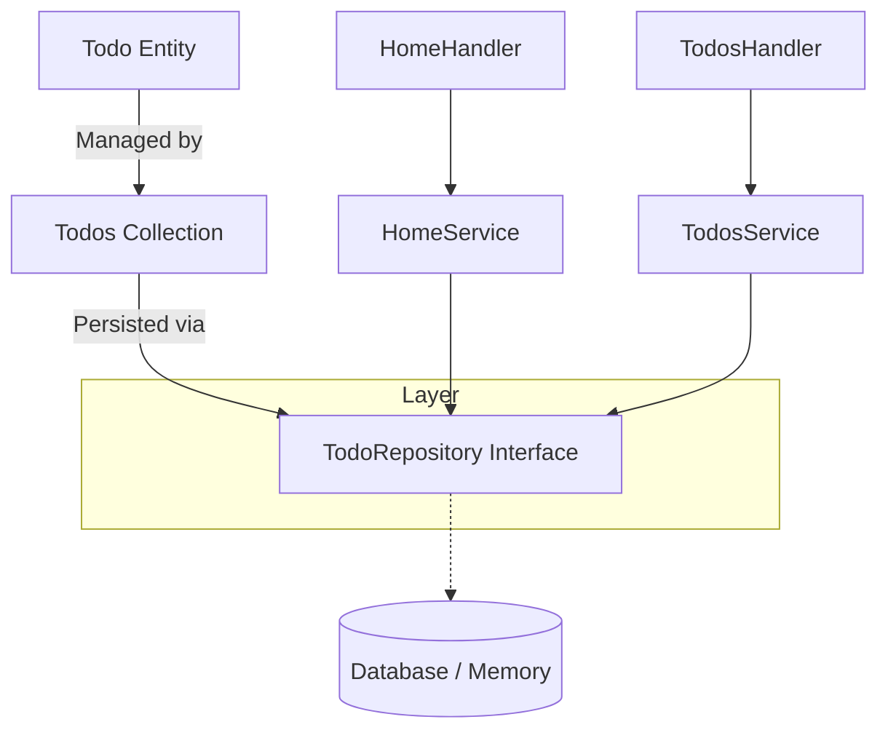

# Domain Model

The Domain Model layer represents the core business objects and rules of the application. It encapsulates the data structures and operations that directly model the problem domain — in this case, a todo list management system.

This layer is responsible for defining the **Todo** entity, collections of todos (**Todos**), and the abstract contract for persistence via **TodoRepository**. It is the foundational layer upon which the service and handler layers build.

---

## Table of Contents

- [Todo Entity](#todo-entity)
- [Todos Collection](#todos-collection)
- [TodoRepository Interface](#todorepository-interface)
- [Integration and Usage](#integration-and-usage)
- [Domain Model Interaction Diagram](#domain-model-interaction-diagram)

---

## Todo Entity

The `Todo` struct defines the shape of a basic todo item within the application.

### Key fields:
- `ID` (uuid.UUID): A unique identifier for the todo.
- `Description` (string): Text description of the task.
- `Completed` (bool): Completion status.
- `CreatedAt` (time.Time): Timestamp when the todo was created.

### Primary operations:
- **NewTodo**: Creates a new Todo instance with a fresh UUID and sets default fields.
- **Update**: Modifies the todo’s completed status and description.

### Code Example

```go
import (
  "time"
  "github.com/google/uuid"
)

// Todo represents a task item
type Todo struct {
  ID          uuid.UUID
  Description string
  Completed   bool
  CreatedAt   time.Time
}

// NewTodo creates a Todo with a new UUID and current time
func NewTodo(description string) *Todo {
  return &Todo{
    ID:          uuid.New(),
    Description: description,
    Completed:   false,
    CreatedAt:   time.Now(),
  }
}

// Update modifies completion status and description
func (t *Todo) Update(completed bool, description string) {
  t.Completed = completed
  t.Description = description
}
```

Source: [internal/domain/todo.go](/internal/domain/todo.go)

---

## Todos Collection

`Todos` represents an ordered in-memory collection of pointers to `Todo` objects. This type provides convenient methods to manage todo items collectively.

### Responsibilities:

- Creating a new `Todos` collection.
- Adding a new todo (`Add`).
- Removing a todo by ID (`Remove`).
- Updating a todo (`Update`).
- Searching todos by text query (`Search`).
- Retrieving all todos (`All`).
- Reordering todos based on a new ID sequence (`Reorder`).

### Important Notes:
- This collection abstracts typical list operations so services and handlers interact with a higher level API rather than directly managing todo pointers.
- Methods return the updated or manipulated `Todo` or filtered slices of `Todo` pointers.

### Code Snippet

```go
// Todos is a list of Todo pointers
type Todos struct {
  list []*Todo
}

// NewTodos initializes a Todos collection
func NewTodos() *Todos {
  return &Todos{list: []*Todo{}}
}

// Add creates and appends a new todo
func (t *Todos) Add(description string) *Todo {
  todo := NewTodo(description)
  t.list = append(t.list, todo)
  return todo
}

// Remove deletes a todo by ID
func (t *Todos) Remove(id uuid.UUID) {
  index := t.indexOf(id)
  if index != -1 {
    t.list = append(t.list[:index], t.list[index+1:]...)
  }
}

// A condensed view of other methods omitted for brevity
```

Source: [internal/domain/todos.go](/internal/domain/todos.go)

---

## TodoRepository Interface

The `TodoRepository` interface abstracts data persistence for todo items. It defines the contract any storage backend must fulfill to manage `Todo` entities.

### Methods:

| Method        | Signature                                             | Description                                  |
|---------------|-------------------------------------------------------|----------------------------------------------|
| `Add`         | `Add(description string) *Todo`                       | Adds a new todo                              |
| `Remove`      | `Remove(id uuid.UUID)`                                | Removes a todo by its ID                      |
| `Update`      | `Update(id uuid.UUID, completed bool, description string) *Todo` | Updates a todo                              |
| `Search`      | `Search(search string) []*Todo`                       | Returns todos matching the search criteria  |
| `All`         | `All() []*Todo`                                       | Returns all todos                            |
| `Get`         | `Get(id uuid.UUID) *Todo`                             | Retrieves a todo by ID                        |
| `Reorder`     | `Reorder(ids []uuid.UUID) []*Todo`                    | Reorders todos by a list of IDs              |

### Purpose:
- Provide abstraction over storage (in-memory, database, etc.)
- Allow service layers to operate independently of persistence details

Source: [internal/domain/todo_repository.go](/internal/domain/todo_repository.go)

---

## Integration and Usage

The Domain Model integrates with the broader system as follows:

- **Service Layer**: Composes the `TodoRepository` interface to perform business logic by leveraging domain operations.
  - Home and Todos features rely on domain models to query, update, and reorder todos.
- **Handlers**: Call services which depend on domain models to fetch and manipulate todo data, preparing responses.
- **Repositories / Backend**: Concrete implementations of `TodoRepository` fulfill persistence details.

### Key Dependencies:

- `github.com/google/uuid` for unique identifiers.
- `time` package for timestamps.

### Typical Flow:



This flow highlights the Domain Model as the defining structure upon which business logic and storage interactions depend.

---

## Domain Model Interaction Diagram



This diagram shows how the domain models (`Todo`, `Todos`) are encapsulated by the repository interface and connected upward to the service and handler layers.

---

## See Also
- [Todo Model](../API%20Reference/Domain%20Layer/Todo%20Model.md)
- [Todos Model](../API%20Reference/Domain%20Layer/Todos%20Model.md)
- [TodoRepository Interface](../API%20Reference/Domain%20Layer/TodoRepository%20Interface.md)
- [Service Layer Architecture](../Architecture/Service%20Layer%20Architecture.md)

---