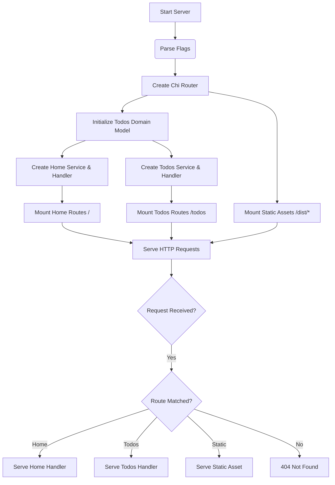

# Table of Contents

- [Overview](#overview)
- [Server Setup](#server-setup)
- [Routing Configuration](#routing-configuration)
- [Middleware and Static Assets](#middleware-and-static-assets)
- [Integration and Architecture](#integration-and-architecture)
- [Mermaid Diagram of Server Flow](#mermaid-diagram-of-server-flow)
- [Code Example: `cmd/server/main.go`](#code-example-cmdservermaingo)

---

## Overview

This section details the **routing and server setup** for the Todo web application. The server is the backbone of the app that initializes an HTTP server, sets up routing paths, mounts feature handlers, and serves static files necessary for the client.

Understanding this setup helps clarify how incoming HTTP requests are routed to appropriate features (like the home page or todo APIs) and how the server serves static frontend assets.

## Server Setup

The entry point of the application is in the `cmd/server/main.go` file. It performs the following critical functions:

- Parses configuration flags (such as the HTTP port to listen on).
- Creates a router instance using the `chi` router library.
- Initializes the in-memory `Todos` domain model with default todo items.
- Creates feature services and handlers for the home page and todos functionality.
- Mounts feature routes and static assets middleware onto the router.
- Starts an HTTP server listening on the specified port.

## Routing Configuration

Routing is handled using the `chi` router (`github.com/go-chi/chi/v5`), an idiomatic lightweight routing library for Go.

Features and static assets are mounted with clear separation:

- **Home feature** is mounted at the root path `/` to handle the landing page.
- **Todos feature** is mounted under `/todos` to handle todo CRUD and other actions.
- **Static assets** (JS, CSS, images) are mounted under `/dist/*`, served from embedded files.

This separation allows modular development and clean URL structure.

## Middleware and Static Assets

Static assets (bundled frontend resources) are embedded into the binary using Go's embed package and served via a chi router under the `/dist/*` path.

Middleware layers such as logging, recovery, or CORS (if added) can be plugged into the chi router before the routes are mounted.

The asset mount ensures that HTTP requests for JS, CSS, or images are served efficiently from the embedded filesystem.

## Integration and Architecture

- The server setup composes the domain layer (`internal/domain`) where the `Todos` model lives.
- Feature services (`internal/features/home` and `internal/features/todos`) operate on the domain and expose business logic.
- Handlers (`home.Handler` and `todos.Handler`) bind the services to HTTP routes.
- The chi router glues these handlers with URL paths.
- Static asset embedding (`internal/assets`) is mounted to provide frontend resources.

The server acts as the orchestrator between the HTTP transport layer and the internal application layers, ensuring clean separation of concerns and extensibility.

## Mermaid Diagram of Server Flow



## Code Example: `cmd/server/main.go`

```go
package main

import (
	"flag"
	"net/http"

	"github.com/go-chi/chi/v5"

	"internal/domain"
	"internal/features/home"
	"internal/features/todos"
	"internal/assets"
)

func main() {
	// Command-line port flag
	var port string
	flag.StringVar(&port, "port", ":3000", "HTTP listen port")
	flag.Parse()

	// Create router
	router := chi.NewRouter()

	// Initialize domain data store (in-memory todos list)
	list := domain.NewTodos()

	// Add default todos
	list.Add("Build todo app")
	list.Add("Test todo app")

	// Setup and mount Home feature
	homeService := home.NewService(list)
	homeHandler := home.NewHandler(homeService)
	home.Mount(router, homeHandler)

	// Setup and mount Todos feature
	todosService := todos.NewService(list)
	todosHandler := todos.NewHandler(todosService)
	todos.Mount(router, todosHandler)

	// Mount static assets
	assets.Mount(router)

	// Start HTTP server
	srv := &http.Server{
		Addr:    port,
		Handler: router,
	}

	_ = srv.ListenAndServe()
}
```

---

[Source code for this setup](cmd/server/main.go)