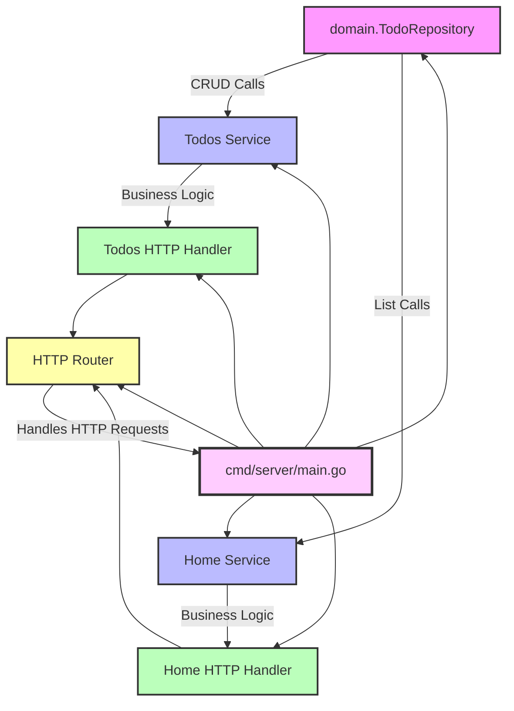

# Service Layer Architecture

The **Service Layer** acts as the core business logic bridge between the domain model and the HTTP handlers in this todo web application. It encapsulates use case implementations, mediates interactions with the domain repository interfaces, and provides a clean API for features such as listing, creating, updating, deleting, searching, and sorting todo items.

This page explains how the service layer is structured for both the **Home** and **Todos** features, illustrating their responsibilities, interactions with the domain, and integration within the overall architecture.

---

## Table of Contents

- [Overview](#overview)
- [Home Service](#home-service)
  - [Service Interface](#service-interface)
  - [Implementation Details](#implementation-details)
- [Todos Service](#todos-service)
  - [Service Interface](#service-interface-1)
  - [Implementation Details](#implementation-details-1)
- [Integration with Domain and Handlers](#integration-with-domain-and-handlers)
- [Service Layer Diagram](#service-layer-diagram)

---

## Overview

The service layer centralizes all business logic for manipulating todo data independently of transport layers or UI details. It implements operations such as:

- Retrieving full todo lists
- Adding new todo entries
- Updating existing todos
- Searching todos by terms
- Sorting todos by order
- Removing todos

Two distinct services exist, reflecting the core application features:

- **Home Service:** Responsible mainly for listing todos to display on the home page.
- **Todos Service:** Supports full CRUD, search, and sorting operations on todos.

Both services depend on a **domain repository** interface (`domain.TodoRepository`) that abstracts persistence and domain logic.

---

## Home Service

The **Home Service** provides a simple interface for retrieving todos for the home page. It mainly delegates calls to the domain repository without adding much extra logic.

### Service Interface

```go
// Service defines the home service interface
// responsible for listing todos.
type Service interface {
  List(ctx context.Context) ([]*domain.Todo, error)
}
```

### Implementation Details

The service implementation composes a `domain.TodoRepository`:

```go
// service implements Service

type service struct {
  todos domain.TodoRepository
}

// NewService creates a new service instance
func NewService(todos domain.TodoRepository) Service {
  return &service{todos: todos}
}

// List returns all todos via the repository
func (s *service) List(ctx context.Context) ([]*domain.Todo, error) {
  return s.todos.All()
}
```

> The home service offers only `List` operation reflecting its focused UI role.

See the full source in [home/service.go](internal/features/home/service.go).

---

## Todos Service

The **Todos Service** supports full feature operations including create, update, delete, search, reorder, and retrieve on todo items. It fully orchestrates business rules while delegating persistence to the domain layer.

### Service Interface

```go
// Service defines todos feature service interface
// implementing CRUD and sorting operations.
type Service interface {
  Add(ctx context.Context, description string) (*domain.Todo, error)
  Remove(ctx context.Context, id uuid.UUID) error
  Update(ctx context.Context, id uuid.UUID, completed bool, description string) (*domain.Todo, error)
  Search(ctx context.Context, search string) ([]*domain.Todo, error)
  Get(ctx context.Context, id uuid.UUID) (*domain.Todo, error)
  Sort(ctx context.Context, ids []uuid.UUID) error
}
```

### Implementation Details

The implementation composes a `domain.TodoRepository` and calls its methods:

```go
// service implements Service

type service struct {
  todos domain.TodoRepository
}

// NewService creates new todos service
func NewService(todos domain.TodoRepository) Service {
  return &service{todos: todos}
}

func (s *service) Add(ctx context.Context, description string) (*domain.Todo, error) {
  return s.todos.Add(description), nil
}

func (s *service) Remove(ctx context.Context, id uuid.UUID) error {
  s.todos.Remove(id)
  return nil
}

func (s *service) Update(ctx context.Context, id uuid.UUID, completed bool, description string) (*domain.Todo, error) {
  return s.todos.Update(id, completed, description), nil
}

func (s *service) Search(ctx context.Context, search string) ([]*domain.Todo, error) {
  return s.todos.Search(search), nil
}

func (s *service) Get(ctx context.Context, id uuid.UUID) (*domain.Todo, error) {
  return s.todos.Get(id), nil
}

func (s *service) Sort(ctx context.Context, ids []uuid.UUID) error {
  s.todos.Reorder(ids)
  return nil
}
```

This service implements all core todo operations for the feature’s handlers.

Reference the complete code at [todos/service.go](internal/features/todos/service.go).

---

## Integration with Domain and Handlers

- **Domain Layer:**
  - Services interact with the `domain.TodoRepository` interface for all data operations.
  - Domain encapsulates core todo entities, repository interfaces, and in-memory or persistent implementations.

- **Handlers (Controllers):**
  - HTTP handlers instantiate services and call their methods to implement endpoints.
  - The separation allows handlers to be thin and focus on request/response plumbing.

- **Router and Main Setup:**
  - The main server initializes domain repositories and creates services.
  - Handlers are initialized with these services and mounted to routes.
  - This clear layering enhances testability and modularity.

### Example from Server Setup

```go
// Initialize domain todo list repository
list := domain.NewTodos()

// Create home and todos services
homeService := home.NewService(list)
todosService := todos.NewService(list)

// Create handlers with services
homeHandler := home.NewHandler(homeService)
todosHandler := todos.NewHandler(todosService)

// Mount handlers to router
home.Mount(router, homeHandler)
todos.Mount(router, todosHandler)
```

---

## Service Layer Diagram



---

## Summary

The service layer is a critical part of the todo application’s architecture, encapsulating business rules and coordinating domain repository interactions. By maintaining simple, well-defined interfaces and implementations:

- It facilitates modular design and testability.
- Keeps HTTP handlers decoupled from business logic.
- Adheres to separation of concerns.

Together, the Home and Todos services provide a robust foundation for the application’s feature set.


---

For further details and source, see these files:
- [Home Service](internal/features/home/service.go)
- [Todos Service](internal/features/todos/service.go)
- [Domain TodoRepository](internal/domain/todo_repository.go)
- [Server Main Entry](cmd/server/main.go)
