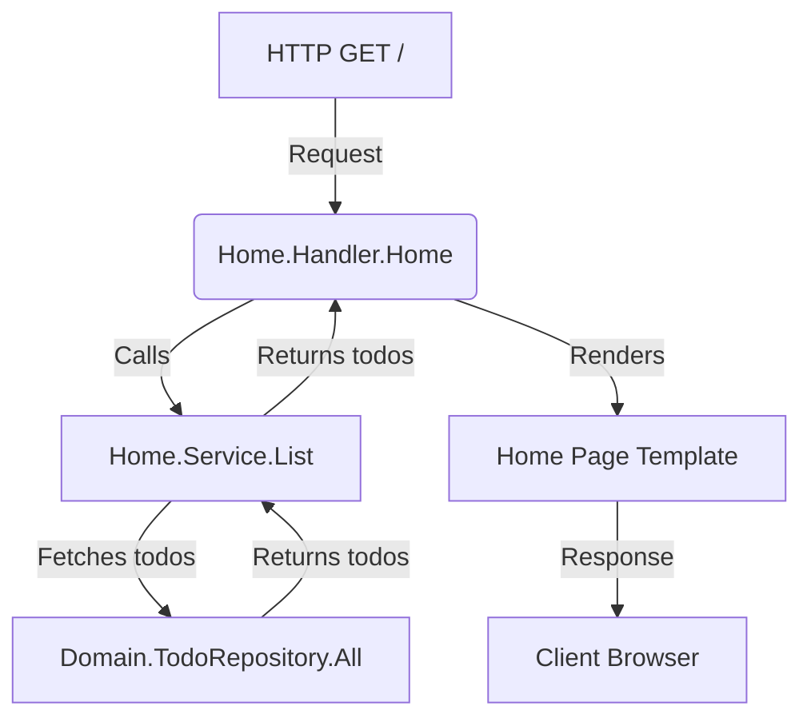

# Table of Contents

- [Introduction](#introduction)
- [Overview](#overview)
- [Core Components](#core-components)
- [Example Usage](#example-usage)
- [Integration and Architecture](#integration-and-architecture)
- [Diagram: Home Feature Flow](#diagram-home-feature-flow)
- [Source Code References](#source-code-references)

---

## Introduction

The **Home Feature** serves as the entry point of the application’s user interface. It provides a simple, focused view that lists todo items and allows users to get a summary of their current tasks. This feature manages the retrieval and rendering of todos on the root path (`/`) and delegates all business logic to its service layer.

This documentation explains the design, implementation, and integration of the Home Feature in the overall todo web application.

## Overview

The Home Feature handles HTTP requests at the root URL (`/`) and renders the home page listing all todos. It acts as a middleman between the UI layer (HTTP handlers) and the domain layer (todo data and business logic).

Key Responsibilities:
- Listing todos
- Rendering the home page with todos
- Handling any errors from the service layer

The feature is kept intentionally simple compared to the Todos Feature which handles CRUD operations. It focuses entirely on reading/displaying todos.

## Core Components

### Handler

The handler provides a `Handler` interface and an implementation that uses a Home Service to fetch todos and render the home page.

- **Handler.Home**: HTTP handler function for GET `/`.
- **NewHandler(service Service) -> Handler**: Factory function to create a new handler.
- **Mount(r chi.Router, h Handler)**: Sets up routing for the home feature on the root path.

### Service

The service layer encapsulates business logic and holds a reference to the domain todo repository. It exposes a `List` method to retrieve all todos.

- **Service.List(ctx context.Context) ([]*domain.Todo, error)**: Retrieves all todo items.
- **NewService(todos domain.TodoRepository) -> Service**: Creates an instance of the home service.

### Domain

The feature depends on the domain's `TodoRepository` interface to obtain todo data, ensuring separation of concerns and easy testability.

## Example Usage

```go
package main

import (
  "context"
  "net/http"

  "github.com/go-chi/chi/v5"
  "yourapp/internal/domain"
  "yourapp/internal/features/home"
)

func main() {
  router := chi.NewRouter()
  todosRepo := domain.NewTodos()  // In-memory repository

  // Create Home service with domain repository
  homeService := home.NewService(todosRepo)

  // Create Home handler
  homeHandler := home.NewHandler(homeService)

  // Mount home routes at root
  home.Mount(router, homeHandler)

  http.ListenAndServe(":3000", router)
}
```

This example illustrates basic wiring where the home handlers are mounted to the router and the service interacts with the domain layer to list todos.

## Integration and Architecture

The Home Feature fits within the broader application architecture as follows:

- **Domain Layer**: Provides the `TodoRepository` interface and in-memory implementation which stores todos.
- **Service Layer (Home.Service)**: Acts as a facade over the domain repository, exposing a focused interface to list todos.
- **HTTP Handler Layer (Home.Handler)**: Handles HTTP requests, calls the service's `List()` method, then invokes the templating engine to render the retrieved todos on the home page.
- **Router (chi Router)**: Routes `/` requests to the home handler.

Dependencies:
- `domain.TodoRepository`: Abstracts the underlying todo store.
- `github.com/go-chi/chi/v5`: HTTP routing.
- `internal/templates/pages`: For rendering the home page.

The pattern ensures loose coupling:
- The handler knows about the service.
- The service knows about the domain repository.
- Domain repository handles data.

## Diagram: Home Feature Flow



This diagram highlights the flow of an HTTP request through the Home Feature, from the incoming request to rendering the response.

## Source Code References

- [Home Handler Implementation](/internal/features/home/handler.go)
- [Home Service Implementation](/internal/features/home/service.go)
- [Domain TodoRepository Interface](/internal/domain/todo_repository.go)
- [Domain Todos Implementation](/internal/domain/todos.go)

---

<Note>
The Home Feature is deliberately kept minimal for simplicity, allowing effortless extension or integration with more complex features like Todos management or user authentication.
</Note>