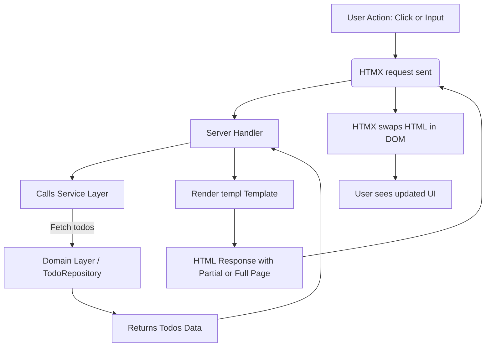

# Technologies: HTMX, templ & TailwindCSS

## Table of Contents
- [Introduction](#introduction)
- [HTMX Overview](#htmx-overview)
- [templ Templating Engine](#templ-templating-engine)
- [TailwindCSS for Styling](#tailwindcss-for-styling)
- [Integration with the Application](#integration-with-the-application)
- [Example Usage](#example-usage)
- [Interaction Flow Diagram](#interaction-flow-diagram)

---

## Introduction

This page explains how **HTMX**, **templ**, and **TailwindCSS** are used together in this todo web application to deliver a modern, interactive, and maintainable user experience. These technologies combine to provide:

- Declarative, server-driven UI updates with HTMX.
- Structured HTML rendering via the templ templating engine.
- Utility-first CSS styling powered by TailwindCSS.

Below, each technology's role and integration details are described, along with example usage and architecture insights.

---

## HTMX Overview

[HTMX](https://htmx.org/) is a JS library that enables modern dynamic web applications by extending HTML with attributes to perform AJAX, CSS transitions, and WebSocket communications seamlessly. In this project, HTMX is used to:

- Fetch partial HTML snippets dynamically without full page reloads.
- Support interactive features like sorting and inline editing by swapping parts of the DOM.
- Provide progressive enhancement with minimal client-side complexity.

HTMX works by attaching attributes to HTML elements, for example:

```html
<button hx-post="/todos/sort" hx-trigger="sort" hx-target="#todos-list">Sort Todos</button>
```

This makes requests and updates portions of the page automatically.


---

## templ Templating Engine

`templ` is the templating system used to render both full page and partial HTML views on the server side. It offers:

- Strong typing and composability for templates.
- Support for defining reusable partials and page components.
- Integration friendly with service and handler layers.

Templates are structured into packages such as `pages` for full pages and `partials` for components:

```go
// Rendering todos partial
renderer := partials.RenderTodos(todos)
err := renderer.Render(ctx, w)
```

By using `templ`, the server generates HTML fragments tailored to the current state and request, which HTMX then swaps into the page.


---

## TailwindCSS for Styling

TailwindCSS is a utility-first CSS framework used for styling the UI components with:

- Rapid development with utility classes (e.g., `p-4`, `text-center`, `bg-indigo-600`).
- Responsive and customizable styling without writing custom CSS.
- Easily maintainable, consistent visual language across the app.

Example button with TailwindCSS styling:

```html
<button class="px-4 py-2 bg-indigo-600 text-white rounded hover:bg-indigo-700">Add Todo</button>
```

The embedded frontend assets in `internal/assets` include the Tailwind-generated CSS.


---

## Integration with the Application

These three technologies integrate within the application as follows:

- **HTMX** augments server-rendered HTML delivered by **templ** templates, making the UI reactive and dynamic without heavy frontend frameworks.
- The **handler** layer in Go uses the **service** to obtain domain data, then executes **templ** templates to produce HTML responses.
- **TailwindCSS** styles these templates, ensuring a clean and modern UI that is consistent and responsive.
- Static assets including TailwindCSS stylesheets and JS are embedded and served through the `/dist/*` route configured with the `internal/assets` package.

This creates a clean separation of concerns:

- Backend business logic and rendering: Go + templ.
- Client-side interaction: HTMX.
- Styling: TailwindCSS.


---

## Example Usage

Below is a minimal example of how an HTMX-enabled todo list update is handled.

```go
// Handler method to search todos with HTMX support
func (h handler) Search(w http.ResponseWriter, r *http.Request) {
    ctx := r.Context()
    search := r.URL.Query().Get("search")

    todos, err := h.service.Search(ctx, search)
    if err != nil {
        http.Error(w, "Failed to search todos", http.StatusInternalServerError)
        return
    }

    var renderer templ.Renderer

    if isHTMX := r.Header.Get("HX-Request"); isHTMX == "true" {
        // Render partial todos list for HTMX swap
        renderer = partials.RenderTodos(todos)
    } else {
        // Render full todos page
        renderer = pages.TodosPage(todos, search)
    }

    if err := renderer.Render(ctx, w); err != nil {
        http.Error(w, "Error rendering response", http.StatusInternalServerError)
    }
}
```

Here, HTMX triggers a search request, the server renders only the matching todos partial, and HTMX swaps that fragment on the client.


---

## Interaction Flow Diagram




---

## Related Source Code

- Server entrypoint with routing setup: [`cmd/server/main.go`](https://mintlify.com/cmd/server/main.go)
- Todos HTTP handlers and HTMX integration: [`internal/features/todos/handler.go`](https://mintlify.com/internal/features/todos/handler.go)
- templ templates for pages and partials: [`internal/templates/pages`](https://mintlify.com/internal/templates/pages), [`internal/templates/partials`](https://mintlify.com/internal/templates/partials)
- Static assets embedding and serving: [`internal/assets/embed.go`](https://mintlify.com/internal/assets/embed.go)


---

<Info>
**Summary:** By leveraging HTMX, templ, and TailwindCSS together, this application achieves a streamlined full-stack setup that provides interactive UI experiences powered by server-rendered HTML, minimal JS, and flexible styling.
</Info>
