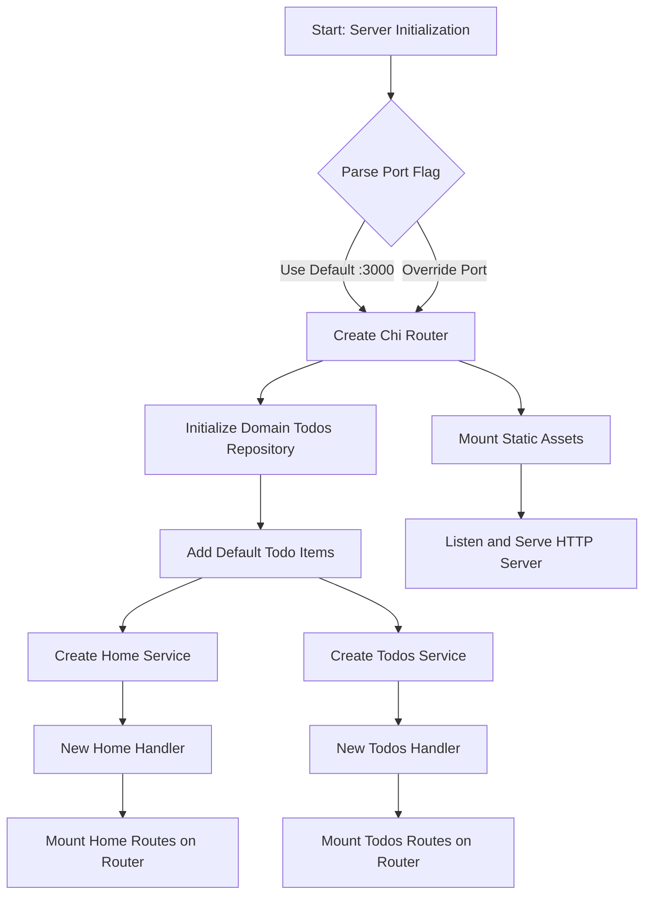

# Installation and Running

This guide covers how to install, configure, and run the Todo web server application. It explains the initial setup steps, configuration options, and details on launching the application so you can start using the Todo features immediately.

---

## Table of Contents

- [Prerequisites](#prerequisites)
- [Installation](#installation)
- [Configuration](#configuration)
- [Running the Server](#running-the-server)
- [Integration Overview](#integration-overview)

---

## Prerequisites

Before installing and running the server, ensure your environment meets the following requirements:

- Go programming language installed (version 1.16+ recommended)
- `git` for cloning repositories (optional if you download sources directly)
- Internet connection to download dependencies

---

## Installation

### Clone the repository

Obtain the source code using Git or download manually:

```bash
# Using Git
git clone https://github.com/your-org/todo-app.git
cd todo-app
```

### Download dependencies

Use `go mod` to fetch required packages:

```bash
go mod download
```

This installs dependencies like [chi router](https://github.com/go-chi/chi/v5) and [google/uuid](https://github.com/google/uuid).

---

## Configuration

The server application supports configuration of the listening port via a command-line flag.

### Port Configuration

- Default port: `:3000`

You can override it using the `-port` flag when running the server.

Example:

```bash
./server -port=:8080
```

This sets the HTTP server to listen on port 8080.

---

## Running the Server

To start the Todo web server:

```bash
# Build and run
go run cmd/server/main.go
```

Or if already built:

```bash
./server
```

By default, the server:

- Starts HTTP server on configured port (default `:3000`)
- Initializes an in-memory todo list with three default items
- Mounts routes for home page `/` and `/todos`
- Serves static assets from `/dist/*`

### Basic example code snippet from `cmd/server/main.go`:

```go
package main

import (
  "flag"
  "net/http"
  "github.com/go-chi/chi/v5"
  "internal/domain"
  "internal/features/home"
  "internal/features/todos"
  "internal/assets"
  "log"
)

func main() {
  port := ":3000"  // default port
  flag.StringVar(&port, "port", port, "server listen port")
  flag.Parse()

  router := chi.NewRouter()

  list := domain.NewTodos()
  // Add default Todos
  list.Add("Install Go")
  list.Add("Write documentation")
  list.Add("Test application")

  // Setup home feature and mount
  homeService := home.NewService(list)
  homeHandler := home.NewHandler(homeService)
  home.Mount(router, homeHandler)

  // Setup todos feature and mount
  todosService := todos.NewService(list)
  todosHandler := todos.NewHandler(todosService)
  todos.Mount(router, todosHandler)

  // Mount static assets
  assets.Mount(router)

  log.Printf("Starting server on %s", port)
  err := http.ListenAndServe(port, router)
  if err != nil {
    log.Fatal(err)
  }
}
```

---

## Integration Overview

The Todo server application consists of several key components working together:



### Key Integration Points:

- **Domain Layer (`internal/domain`)**: Implements the core `Todos` repository managing todo items in memory.
- **Service Layer (`internal/features/home` & `internal/features/todos`)**: Defines business logic for listing, adding, updating, searching, and deleting todos.
- **Handler Layer**: HTTP handlers register routes and map HTTP requests to service methods.
- **Routing (`github.com/go-chi/chi/v5`)**: Used to mount all handlers and static assets into a single router listening on the configured port.
- **Static Assets (`internal/assets`)**: Embedded frontend assets served on `/dist/*` routes, enabling client UI.

---

## Additional Tips

- Since todos are stored in-memory, all data resets each time the server restarts.
- Extend or replace the domain repository to integrate a persistent database if required.
- Use the `-port` option to run multiple instances locally with different ports.

---

For more details on code design and architecture, visit the following sections:

- [Application Architecture Overview](../Architecture/Application%20Architecture%20Overview)
- [Domain Model](../Architecture/Domain%20Model)
- [Routing and Server Setup](../Architecture/Routing%20and%20Server%20Setup)
