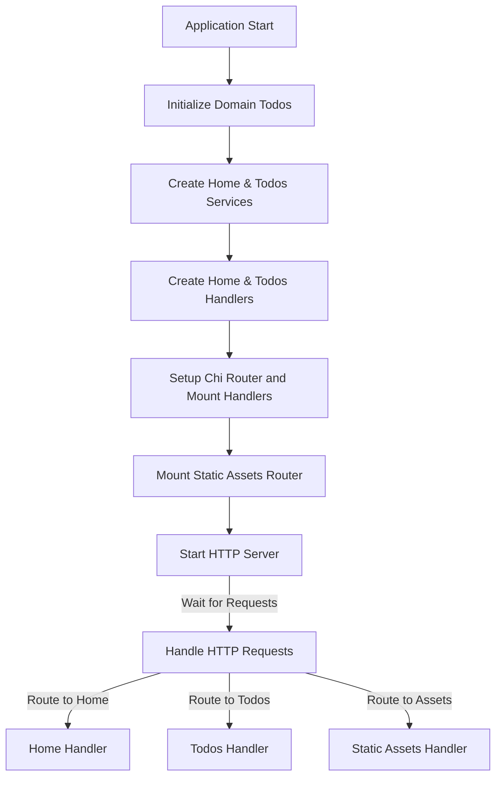

# Table of Contents

- [Introduction](#introduction)
- [Project Overview](#project-overview)
- [Core Components](#core-components)
  - [Domain Layer](#domain-layer)
  - [Service Layer](#service-layer)
  - [HTTP Handlers and Routing](#http-handlers-and-routing)
  - [Static Assets](#static-assets)
- [Application Startup Flow](#application-startup-flow)
- [Integration and Architecture](#integration-and-architecture)
- [Example: Adding a Todo](#example-adding-a-todo)
- [Mermaid Diagram](#mermaid-diagram)

---

## Introduction

This document provides a high-level overview of the project structure and architecture of a Todo web server application implemented in Go. It explains the role of each major component, from domain models to service layers and HTTP handlers, highlighting how these pieces integrate to deliver the full functionality.

## Project Overview

The project implements a todo web application backend with the following capabilities:

- Managing todo items (add, update, delete, reorder, list, search)
- Serving HTTP endpoints for UI and API consumption
- Embedding static frontend assets within the binary for a seamless deployment

The design follows clean architecture principles by separating domain logic, service business logic, and delivery via HTTP handlers while keeping dependencies loosely coupled.

## Core Components

### Domain Layer

Located in [`internal/domain`](internal/domain), this layer provides the core data models and repository interfaces.

- **Todo Model (`todo.go`):** Defines the `Todo` struct featuring
  - Unique identifier (UUID)
  - Description
  - Completion status
  - Timestamps

- **Todos (`todos.go`):** Implements an in-memory collection of `Todo` pointers, with methods to add, update, remove, reorder, and search todos.

- **TodoRepository Interface (`todo_repository.go`):** Abstracts accessing and mutating todo data.

- **Mock Repository (`mock_todo_repository.go`):** Provides a mock implementation for unit testing.

### Service Layer

The service layer encapsulates business logic and interfaces with the domain layer's repositories.

- **Home Service (`internal/features/home/service.go`)**: Provides functionality to list all todos for the home page display.

- **Todos Service (`internal/features/todos/service.go`)**: Implements core todo operations such as add, update, delete, search, get single todo, and reorder.

These services expose abstracted interfaces used by HTTP handlers.

### HTTP Handlers and Routing

Responsible for handling web requests and rendering responses:

- **Home Handler (`internal/features/home/handler.go`):** Handles requests to `/`, lists todos, and renders the home page.

- **Todos Handler (`internal/features/todos/handler.go`):** Manages CRUD operations and sorting on todos under `/todos` endpoints, supports dynamic partial rendering via HTMX.

- **Routing (`cmd/server/main.go`):** Defines routes for handlers using the chi router, mounts features and static assets endpoints, and starts the HTTP server.

### Static Assets

Static client-side assets such as CSS, JavaScript, and HTML files are embedded into the binary:

- **Embedding static assets (`internal/assets/embed.go`):** Uses Go's embed package to bundle the `dist` directory inside the binary.

- **Serving assets:** Exposes a route `/dist/*` to serve embedded static files efficiently from memory.

## Application Startup Flow

The main entrypoint [`cmd/server/main.go`](cmd/server/main.go) follows these steps:

1. **Flags:** Configures a port flag (default `:3000`).
2. **Router:** Creates a new chi router instance.
3. **Domain Initialization:** Instantiates an in-memory todo list and pre-populates it with default todos.
4. **Services:** Constructs the home and todos services passing the todo list as the repository.
5. **Handlers:** Creates handlers for home and todos features.
6. **Mounting:** Sets up routes and mounts assets and feature handlers on the router.
7. **Server:** Creates and starts the HTTP server listening on the configured port.

## Integration and Architecture

The system is composed of collaborating layers adhering to a clean separation of concerns:

- **Domain Layer:** Pure business entities and repository interfaces. No dependencies on frameworks.
- **Service Layer:** Business logic orchestrating domain repositories to implement feature requirements.
- **Handler Layer:** REST/HTTP delivery mechanism calling service methods and rendering templates or redirects.
- **Router:** Defines URL mappings to handlers.
- **Static Assets:** Embedded in the binary and served via a dedicated router mount.

This layering enables maintainability, testability, and clear responsibility boundaries.

## Example: Adding a Todo

```go
import (
  "context"
  "fmt"
  "internal/features/todos"
)

func addTodoExample(service todos.Service) {
  ctx := context.Background()
  newTodo, err := service.Add(ctx, "Buy groceries")
  if err != nil {
    fmt.Println("Error adding todo:", err)
    return
  }
  fmt.Println("Added todo with ID:", newTodo.ID)
}
```

This example shows interacting with the todos service layer to add a new todo item programmatically.

## Mermaid Diagram



---

## Relevant Source Links

- [cmd/server/main.go](cmd/server/main.go): Main server setup and routing
- [internal/domain/todos.go](internal/domain/todos.go): Domain model managing todos collection
- [internal/domain/todo.go](internal/domain/todo.go): Todo struct and methods
- [internal/features/home/handler.go](internal/features/home/handler.go): Home page request handler
- [internal/features/home/service.go](internal/features/home/service.go): Home feature business logic
- [internal/features/todos/handler.go](internal/features/todos/handler.go): Todos HTTP API handlers
- [internal/features/todos/service.go](internal/features/todos/service.go): Todos feature service logic
- [internal/assets/embed.go](internal/assets/embed.go): Static asset embedding and routing

---

This overview serves as a foundation for understanding the internals of the todo web server and can guide developers exploring, extending, or maintaining the system.