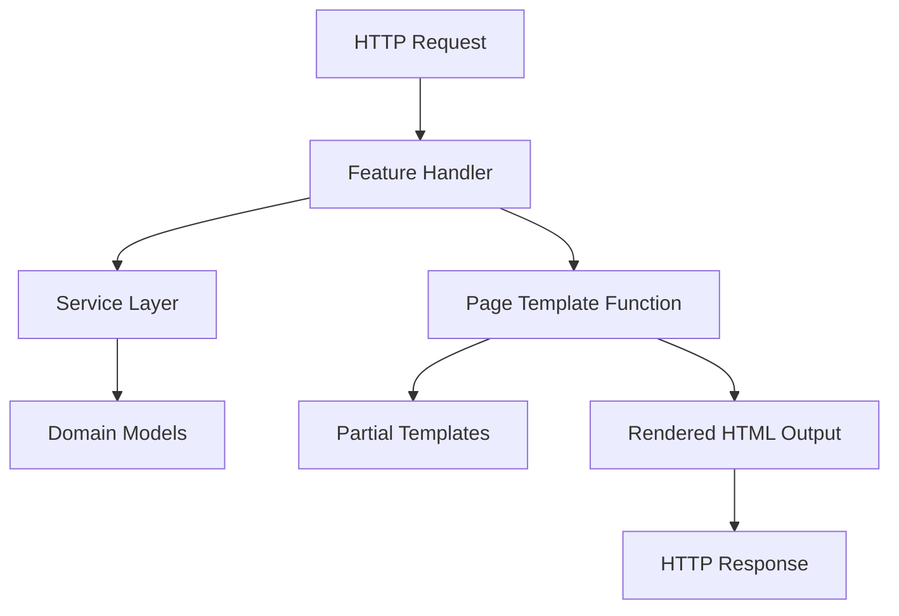

# Page Templates

Page templates define the overall layout and structure of complete HTML pages in the application. These templates are used to render full web pages, incorporating page-level data, and assembling together partial templates (like headers, footers, and content sections) into a cohesive user interface.

This documentation covers the usage, integration, and main characteristics of page templates in our todo application.

---

## Table of Contents

- [Overview](#overview)
- [Key Concepts](#key-concepts)
- [Example Page Template](#example-page-template)
- [Integration with Features](#integration-with-features)
- [Page Rendering Flow](#page-rendering-flow)
- [Diagram: Page Template Interaction](#diagram-page-template-interaction)

---

## Overview

Page templates represent the full HTML document that is sent to the browser. They embed dynamic content generated by feature handlers and are responsible for rendering the complete user interface for specific routes.

In the todo app, page templates:

- Provide the shell HTML structure (doctype, `<html>`, `<head>`, `<body>`).
- Define placeholders and blocks to inject feature-specific content.
- Include references to CSS and JS assets.
- Compose partials such as todo list items and forms.

Page templates work closely with **partial templates** to enable modular and reusable UI components.


## Key Concepts

- **Page vs Partial**: A page template outputs a full webpage, while partial templates render fragments of HTML for reuse.
- **Templating Engine**: The app uses the `templ` templating system that supports Go templates with additional helpers and rendering abstractions.
- **Renderer Interface**: Page templates implement the `Renderer` interface, enabling them to be rendered with a context and outputted to a `http.ResponseWriter`.
- **Data Binding**: Page templates receive typed data structures, e.g., a list of todos or a single todo item, to drive dynamic rendering.

## Example Page Template

Below is a simplified example of how a todo list page template might be structured:

```go
package pages

import "github.com/a-h/templ"

// TodosPage renders the full page listing todos
func TodosPage(todos []Todo, search string) templ.Renderer {
    // Compose with header, footer partials, and inject todos
    return templ.HTML(`
    <!DOCTYPE html>
    <html lang="en">
      <head>
        <meta charset="UTF-8" />
        <title>Todos</title>
        <link rel="stylesheet" href="/dist/styles.css" />
      </head>
      <body>
        <header>Todo App</header>
        <main>
          <form action="/todos" method="get">
            <input type="search" name="q" value="` + templ.HTMLEscape(search) + `" />
          </form>
          <ul>
            {{range .Todos}}
              <li>{{.Description}} (Completed: {{.Completed}})</li>
            {{end}}
          </ul>
        </main>
        <footer>© 2024 Todo App</footer>
      </body>
    </html>
    `)
}
```

**Note:** The actual implementation uses templ's Renderers and is more structured with partial templates.


## Integration with Features

Page templates integrate tightly with feature handlers and services:

- **Handlers** (e.g., in `/internal/features/home/handler.go` or `/internal/features/todos/handler.go`) call page templates to generate the HTTP response.
- The handlers fetch or assemble domain model data (e.g., todo lists) via the service layer.
- The page template receives this data as input parameters and produces the full HTML.
- Partial templates are composed inside page templates to reuse UI fragments.

For example, the `internal/features/todos/handler.go` calls `pages.TodosPage(todos, search)` to render the `/todos` page.


## Page Rendering Flow

1. **Request Handling**: HTTP request arrives at a route handled by a feature handler.
2. **Data Retrieval**: The handler calls the service layer to get domain data (todos, etc.).
3. **Template Rendering**: The handler calls a page template function passing data.
4. **Page Template Execution**: The page template generates full HTML output, including calls to partial templates.
5. **Response Write**: The completed HTML is written to the HTTP response.

This flow ensures a clean separation between data processing (services), control (handlers), and presentation (templates).


## Diagram: Page Template Interaction




## Additional Information & Links

- For details on how partial templates are structured and used, see [Partial Templates](internal/templates/partials).
- Core page templates can be found in the `/internal/templates/pages` directory.
- The handlers integrating page templates are in [Home Handler](internal/features/home/handler.go) and [Todos Handler](internal/features/todos/handler.go).

---

<Page Templates provide the structural foundation for our web UI rendering by composing partials and embedding dynamic data into full HTML responses. They play a crucial role in cleanly separating UI layout from business logic and routing.>

