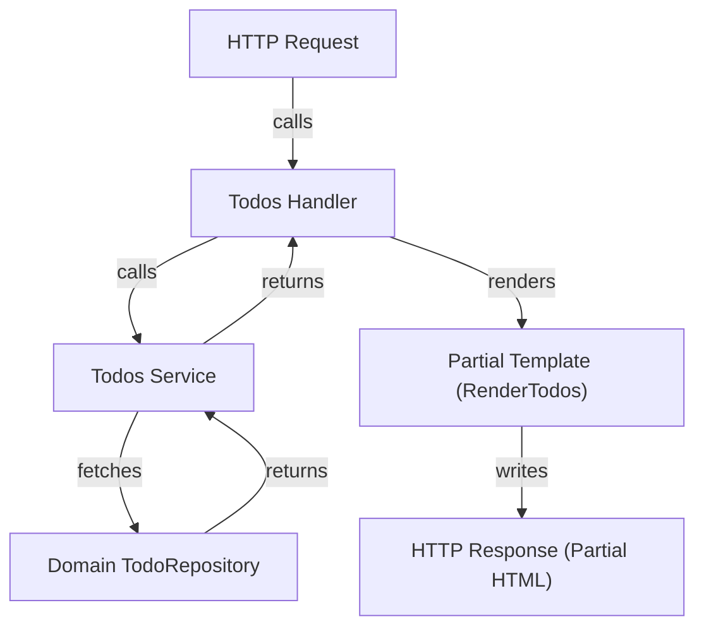

# Partial Templates

Partial templates are reusable template fragments designed to render specific portions of a web page's UI. Unlike full page templates that represent complete views, partial templates focus on smaller areas such as a list of items, a single item display, or form components. 

In this application, partial templates help build a dynamic, responsive frontend by enabling fine-grained rendering of todo items and fragments, which can be replaced or updated independently (especially when used with HTMX for progressive enhancement).

---

## Table of Contents

- [What Are Partial Templates?](#what-are-partial-templates)
- [Purpose and Advantages](#purpose-and-advantages)
- [Common Partial Templates in This Project](#common-partial-templates-in-this-project)
- [Integration and Usage](#integration-and-usage)
- [Example: Rendering a List of Todos](#example-rendering-a-list-of-todos)
- [Mermaid Diagram: Partial Template Rendering Flow](#mermaid-diagram-partial-template-rendering-flow)
- [Source Files](#source-files)

---

## What Are Partial Templates?

Partial templates are snippets of UI markup rendered server-side, which represent specific components or segments of a page rather than an entire page. This modular approach allows for the composition of complex pages by including or injecting these smaller parts.

This contrasts with “page templates,” which wrap the entire HTML page structure.

## Purpose and Advantages

- **Reusability:** Use the same template fragment in multiple places, reducing duplication.
- **Maintainability:** Smaller templates are easier to read, test, and update.
- **Dynamic Updates:** Paired with HTMX or similar, partial templates allow parts of the page to update dynamically (e.g., after AJAX calls).
- **Separation of Concerns:** Keeps UI components isolated, which aligns with component-based UI development.

## Common Partial Templates in This Project

The todos feature uses several partial templates located in the `internal/templates/partials` directory.

Examples include:

- `RenderTodos` - Renders a collection/list of todo items.
- `RenderTodo` - Renders the UI for a single todo item.
- `EditTodoForm` - Renders the form UI for editing a todo.

These partials are employed by the handlers inside `internal/features/todos/handler.go` to render responses for JSON or HTMX requests.

## Integration and Usage

Partial templates are integrated into the request handling flow primarily within the todos feature.

- The **todos handler** receives HTTP requests for creating, updating, searching, or sorting todos.
- Based on the request type and context (HTMX-enabled or not), the handler calls the appropriate service method to perform business logic.
- The handler then renders the relevant partial template and returns it, enabling dynamic partial page updates.

This design supports:
- Full page loads when needed.
- Partial updates to improve responsiveness and reduce client-server round-trips.

### Related Files and Dependencies

- Partial templates themselves reside in `internal/templates/partials/`.
- Used by handlers such as [`internal/features/todos/handler.go`](../../internal/features/todos/handler.go).
- Service layer (`internal/features/todos/service.go`) provides the data structures (`Todo` models) that the partial templates render.
- Templates are rendered using the `templ` templating system.

## Example: Rendering a List of Todos

Below is a simplified illustration of how a collection of todos is rendered using the partial template `RenderTodos`.

```go
package handler

import (
	"net/http"
	"context"

	"internal/features/todos/service"
	"internal/templates/partials"
)

func (h *handler) Search(w http.ResponseWriter, r *http.Request) {
	ctx := r.Context()
	search := r.URL.Query().Get("search")

	todos, err := h.service.Search(ctx, search)
	if err != nil {
		http.Error(w, err.Error(), http.StatusInternalServerError)
		return
	}

	renderer := partials.RenderTodos(todos)
	err = renderer.Render(ctx, w)
	if err != nil {
		http.Error(w, err.Error(), http.StatusInternalServerError)
	}
}
```

```go
// partials/render_todos.go

func RenderTodos(todos []Todo) Renderer {
	// Returns a Renderer that when invoked, writes the list of
	// todo items HTML markup.
}
```

## Mermaid Diagram: Partial Template Rendering Flow



## Source Files

- For the partial templates themselves, see the [`internal/templates/partials/`](../../internal/templates/partials) directory.
- Handler integration code: [`internal/features/todos/handler.go`](../../internal/features/todos/handler.go)
- Service providing data: [`internal/features/todos/service.go`](../../internal/features/todos/service.go)

---

Partial templates form a key piece in building a responsive and maintainable UI by enabling reusable and dynamic HTML rendering focused on discrete page components.
