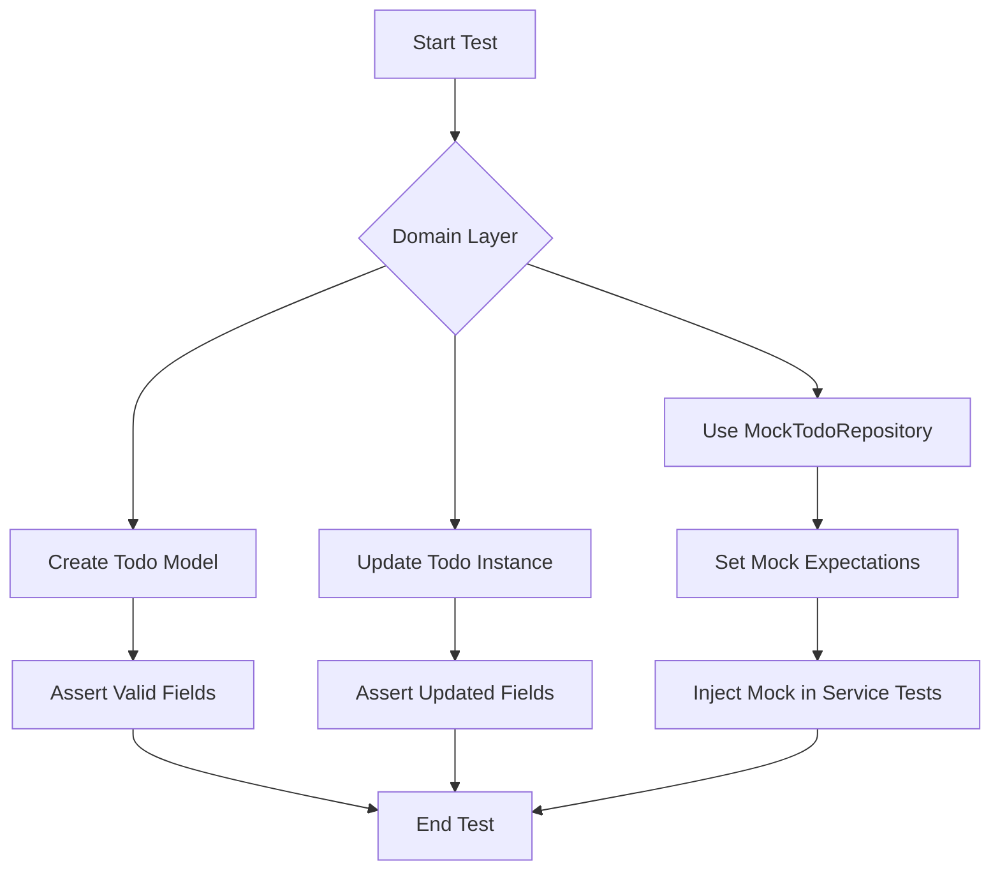

# Domain Layer Testing

This page documents the testing approach and implementation for the **Domain Layer** of the Todo application. The domain layer encapsulates the core business logic — including the `Todo` and `Todos` models, and the `TodoRepository` interface — and thus requires thorough unit testing to guarantee correctness, data integrity, and stable behavior.

---

## Table of Contents

- [Overview](#overview)
- [Testing Domain Models](#testing-domain-models)
  - [Todo Model Tests](#todo-model-tests)
- [Testing Domain Repositories](#testing-domain-repositories)
- [Mocking for Domain Layer](#mocking-for-domain-layer)
- [Integration with Other Layers](#integration-with-other-layers)
- [Example Test Code](#example-test-code)
- [Mermaid Diagram: Domain Test Flow](#mermaid-diagram-domain-test-flow)

---

## Overview

The **Domain Layer** implements the fundamental abstractions and logic related to todo items. Testing here focuses on:

- Validation of domain models (`Todo`) and their behavior.
- Correctness of the domain logic in managing collections of todos (`Todos`).
- Contract conformance of domain repositories handling CRUD operations.

Reliable domain tests help ensure that higher-level features and services build on a solid, predictable foundation.


## Testing Domain Models

The primary domain model `Todo` represents a task with attributes such as `ID`, `Description`, `Completed`, and `CreatedAt`. Unit tests validate operations related to:

- Creation of new todo instances.
- Updating the `completed` state and `description` safely.

### Todo Model Tests

- `TestNewTodo` tests creation of Todos ensuring default field values (e.g., unique ID, timestamp).
- `TestTodo_Update` verifies that updating a todo’s completion status and description works as expected.

These tests reside in the file [`internal/domain/todo_test.go`](/internal/domain/todo_test.go).

## Testing Domain Repositories

`TodoRepository` defines the interface for persisting todos, covering methods such as `Add`, `Remove`, `Update`, `Get`, and `Search`.

Testing here involves:

- Validating correct repository contract implementation.
- Confirming behavior under scenarios like empty repository, updates of existing todos, and searches.

In practice, the concrete implementations are tested individually (e.g., in-memory or persistent stores).

## Mocking for Domain Layer

To facilitate isolated tests of services and handlers depending on the repository API, a mock implementation exists:

- `MockTodoRepository` in [`internal/domain/mock_todo_repository.go`](/internal/domain/mock_todo_repository.go) — autogenerated using `testify/mock`.
- Supports expectations and assertions on calls such as `Add`, `All`, `Get`, `Remove`, and others.

> This mock enables fast, independent testing of business logic without a real storage backend.

## Integration with Other Layers

- **Service Layer:** Calls domain repository methods to manage todos. Unit tests can use the domain mock repository to control repository behavior.
- **Feature Handlers:** Rely on the service layer tested indirectly through domain mocks.

Testing domain logic ensures that foundational data manipulation is correct before progressing to feature or integration tests.

## Example Test Code

Here is an example test case for the `Todo` model, demonstrating creation and update validation.

```go
package domain_test

import (
	"testing"
	"time"

	"github.com/google/uuid"
	"your_project/internal/domain"
)

func TestNewTodo(t *testing.T) {
	desc := "Test todo creation"
	todo := domain.NewTodo(desc)

	if todo.Description != desc {
		t.Errorf("expected description %q, got %q", desc, todo.Description)
	}

	if todo.Completed {
		t.Error("expected todo to be not completed by default")
	}

	if todo.ID == uuid.Nil {
		t.Error("expected todo to have a valid non-nil UUID")
	}

	if time.Since(todo.CreatedAt) > time.Minute {
		t.Error("expected CreatedAt to be recent")
	}
}

func TestTodo_Update(t *testing.T) {
	todo := domain.NewTodo("Initial desc")

	todo.Update(true, "Updated desc")

	if !todo.Completed {
		t.Error("expected todo to be marked as completed")
	}

	if todo.Description != "Updated desc" {
		t.Errorf("expected description %q, got %q", "Updated desc", todo.Description)
	}
}
```

This demonstrates simple validation of model invariants.


## Mermaid Diagram: Domain Test Flow



---

For full test source, see the files:

- [`internal/domain/todo_test.go`](/internal/domain/todo_test.go) 
- [`internal/domain/mock_todo_repository.go`](/internal/domain/mock_todo_repository.go)

Understanding and maintaining domain layer tests is critical for ensuring the stability and correctness of the overall application architecture.

---