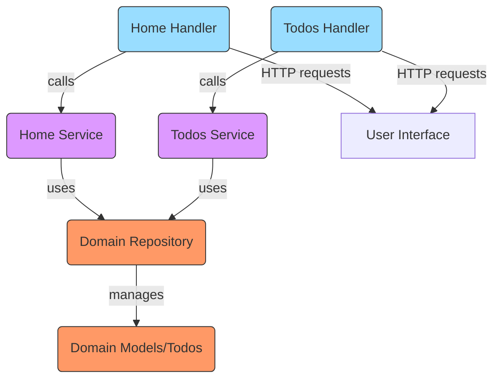

# Feature Layer Testing

Feature Layer Testing focuses on verifying the behavior and correctness of the application's business logic encapsulated in the feature services and handlers. This layer bridges the domain model and the external world by exposing use cases, orchestrating domain interactions, and shaping how data flows through the application.

In the context of this todo application, feature layer tests ensure the todos and home features work as expected, covering core functionalities such as listing, adding, updating, searching, and deleting todos, as well as rendering proper responses.

---

## Table of Contents

- [Overview](#overview)
- [Testing Feature Services](#testing-feature-services)
  - [Example: Todos Service Test](#example-todos-service-test)
- [Testing Feature Handlers](#testing-feature-handlers)
  - [Example: Todos Handler Test](#example-todos-handler-test)
- [Integration In Context](#integration-in-context)
- [Feature to Domain Interaction Diagram](#feature-to-domain-interaction-diagram)

---

## Overview

Feature Layer Testing verifies the implementation of the **feature services** and **HTTP handlers** that compose the application's use cases and presentation logic. Unlike domain tests, which focus on core business models and rules, feature tests ensure that integration between domain and transport layers behave according to requirements.

Key goals include:

- Validating that feature services manipulate the domain model correctly.
- Checking that handlers handle HTTP requests, invoke services, and return proper responses.
- Supporting mocking or stubbing domain interfaces to isolate feature logic.


## Testing Feature Services

Feature services encapsulate business logic related to application features. Testing these services directly ensures that the domain abstractions and use case implementations interact as expected.

### Example: Todos Service Test

Here is a concise example showing how you might test a Todos service method:

```go
package todos_test

import (
    "context"
    "testing"

    "github.com/google/uuid"
    "github.com/stretchr/testify/mock"
    "example.com/project/internal/domain"
    "example.com/project/internal/features/todos"
)

// MockTodoRepository is a testify mock for domain.TodoRepository
// This is typically generated automatically.
type MockTodoRepository struct {
    mock.Mock
}

func (m *MockTodoRepository) Add(description string) *domain.Todo {
    args := m.Called(description)
    return args.Get(0).(*domain.Todo)
}
//... other methods

func TestService_Add(t *testing.T) {
    mockRepo := &MockTodoRepository{}
    svc := todos.NewService(mockRepo)

    description := "Write unit tests"
    // Setup expected call
    mockRepo.On("Add", description).Return(domain.NewTodo(description))

    todo, err := svc.Add(context.Background(), description)
    if err != nil {
        t.Fatalf("expected no error, got %v", err)
    }
    if todo.Description != description {
        t.Errorf("expected description %s, got %s", description, todo.Description)
    }

    mockRepo.AssertExpectations(t)
}
```

This tests the service layer independently by mocking the domain repository and asserting expected interactions.


## Testing Feature Handlers

Handlers handle HTTP layer concerns like parsing requests, calling feature services, and composing HTTP responses. Testing handlers ensures that HTTP endpoints behave correctly according to contract.

### Example: Todos Handler Test

A typical handler test creates an HTTP request and records the response:

```go
package todos_test

import (
    "net/http"
    "net/http/httptest"
    "strings"
    "testing"

    "example.com/project/internal/features/todos"
)

func TestHandler_Create(t *testing.T) {
    // Setup mock service or use a real one with in-memory repo
    svc := todos.NewService(MockInMemoryRepository{})
    handler := todos.NewHandler(svc)

    reqBody := strings.NewReader("description=Test+todo")
    req := httptest.NewRequest("POST", "/todos", reqBody)
    w := httptest.NewRecorder()

    handler.Create(w, req)

    res := w.Result()
    if res.StatusCode != http.StatusSeeOther {
        t.Errorf("expected redirect, got %d", res.StatusCode)
    }
}
```

This ensures correct HTTP interaction including POST parsing, service delegation, and redirect behavior.


## Integration In Context

Feature layer tests sit between domain layer tests (focused on business rules) and end-to-end tests (that test full HTTP stack and persistence). They provide fast, isolated validation of feature-specific logic and HTTP behavior.

### Dependencies
- **Domain layer interfaces** (e.g., `domain.TodoRepository`) are mocked or stubbed.
- **Services** implement use case logic by interacting with domain models.
- **Handlers** expose services over HTTP, often using routers like `chi`.
- Feature layer tests can mock domain dependencies to avoid slow or fragile integration with persistence.


## Feature to Domain Interaction Diagram



---

## Further Reading

- See [Todos Service](internal/features/todos/service.go) for service implementation.
- See [Todos Handler](internal/features/todos/handler.go) for HTTP handler details.
- See [Domain TodoRepository](internal/domain/todo_repository.go) for domain repository contract.
- Explore [Home Feature Handler](internal/features/home/handler.go) as an example of simpler feature handler.

<Note>Proper feature layer testing improves reliability by testing business logic and HTTP behavior with fast and isolated tests, without depending on full integration stack.</Note>
