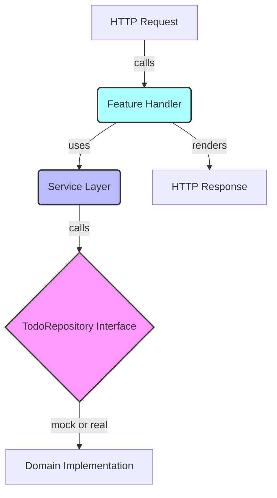

# Feature Layer Testing

Feature Layer Testing focuses on validating the behavior and integration of business logic and HTTP handlers in the application’s feature layers, particularly the **Home** and **Todos** features.

This guide covers the approach and techniques to effectively test the feature layer, which acts as the bridge between the domain model and user-facing HTTP endpoints.

---

## Table of Contents

- [Overview](#overview)
- [Testing Strategy](#testing-strategy)
- [Testing Services](#testing-services)
  - [Home Service Tests](#home-service-tests)
  - [Todos Service Tests](#todos-service-tests)
- [Testing Handlers](#testing-handlers)
  - [Simulating HTTP Requests](#simulating-http-requests)
  - [HTMX and Partial Rendering](#htmx-and-partial-rendering)
- [Integration with Domain Layer](#integration-with-domain-layer)
- [Sample Test Example](#sample-test-example)
- [Feature Layer Testing Architecture Diagram](#feature-layer-testing-architecture-diagram)

---

## Overview

The feature layer encapsulates business rules and HTTP handlers related to application features, such as the **Home** feature that lists todos and the **Todos** feature that manages CRUD and sorting operations.

Testing this layer ensures the correctness of business logic, its interaction with the domain, and the proper handling of HTTP requests and responses.

---

## Testing Strategy

Feature layer testing entails:

- **Unit testing services**: Verifying business logic correctness in isolation using mocked domain repositories.
- **Handler testing**: Simulating HTTP requests to endpoints to assert response status, rendered output, and side effects.
- **Partial response validation**: Particularly when HTMX is involved, for dynamic frontend behaviors.

Mocking domain interfaces like `TodoRepository` allows for effective isolation.

---

## Testing Services

Services in the feature layer implement the domain-application business logic interfaces.

They wrap domain repositories and expose business operations.

### Home Service Tests

Test the `List` method providing retrieval of all todos.

- Mock the domain `TodoRepository.All()` method.
- Verify that the returned todo items are correctly passed through.

### Todos Service Tests

Test methods such as `Add()`, `Remove()`, `Update()`, `Search()`, `Get()`, and `Sort()`.

- Mock relevant domain repository methods.
- Assert the service handles domain return values and errors properly.
- Validate sorting logic updates correctly reorder todos.

Example mocking is done with the autogenerated mock `MockTodoRepository` from `internal/domain/mock_todo_repository.go`.

---

## Testing Handlers

Handlers are tested to ensure they behave correctly given HTTP requests, including proper routing, parameter parsing, integration with services, and rendering.

### Simulating HTTP Requests

Use Go’s `httptest` package to simulate HTTP requests and capture responses.

Validate:

- HTTP status codes returned
- Response body contents (HTML or redirects)
- Proper call to service methods

### HTMX and Partial Rendering

Since the application uses [HTMX](https://htmx.org) for progressive enhancement, handlers respond with specific partial templates when HTMX headers are detected.

Verify that handlers:

- Render partial updates on HTMX requests
- Serve full pages otherwise

---

## Integration with Domain Layer

Feature layer tests mock the **domain** layer to isolate tests from database or stateful logic.

- The domain exposes the `TodoRepository` interface.
- Services use this interface.
- Mock implementations provided allow control over domain responses for feature tests.

This separation allows testing the feature layer’s correctness without depending on persistence.

---

## Sample Test Example

Here is a minimal example illustrating testing a Todos service Add method with a mocked domain repository.

```go
package todos_test

import (
  "context"
  "testing"

  "github.com/google/uuid"
  "github.com/stretchr/testify/mock"
  "github.com/stretchr/testify/require"

  "internal/domain"
  "internal/domain/mock"
  "internal/features/todos"
)

func TestService_Add(t *testing.T) {
  ctx := context.Background()
  mockRepo := &mock.MockTodoRepository{}
  svc := todos.NewService(mockRepo)

  // Setup expected call to domain repository's Add
  mockRepo.On("Add", mock.AnythingOfType("string")).Return(&domain.Todo{ID: uuid.New(), Description: "test todo", Completed: false}, nil)

  todo, err := svc.Add(ctx, "test todo")
  require.NoError(t, err)
  require.Equal(t, "test todo", todo.Description)

  mockRepo.AssertExpectations(t) // Verify all expected calls were made
}
```

This pattern applies similarly for handler tests where HTTP requests are performed.

---

## Feature Layer Testing Architecture Diagram



---

## Source Links

- Feature Home handler: [internal/features/home/handler.go](internal/features/home/handler.go)
- Feature Todos handler: [internal/features/todos/handler.go](internal/features/todos/handler.go)
- Feature Home service: [internal/features/home/service.go](internal/features/home/service.go)
- Feature Todos service: [internal/features/todos/service.go](internal/features/todos/service.go)
- Mock domain repository: [internal/domain/mock_todo_repository.go](internal/domain/mock_todo_repository.go)

---

This testing approach ensures robust verification of the application’s business and HTTP interface layer, providing confidence in feature correctness and maintainability.